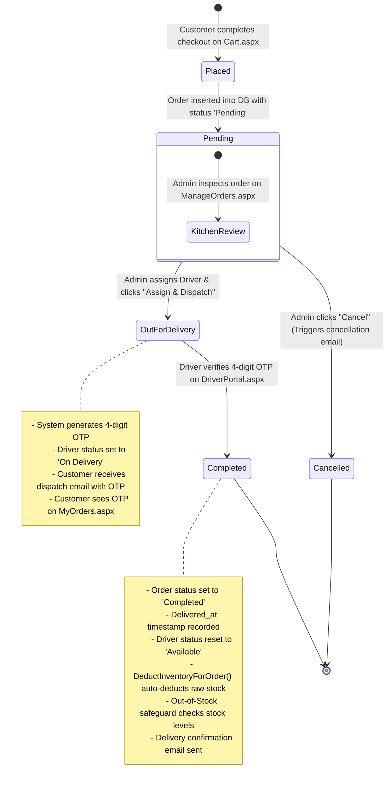
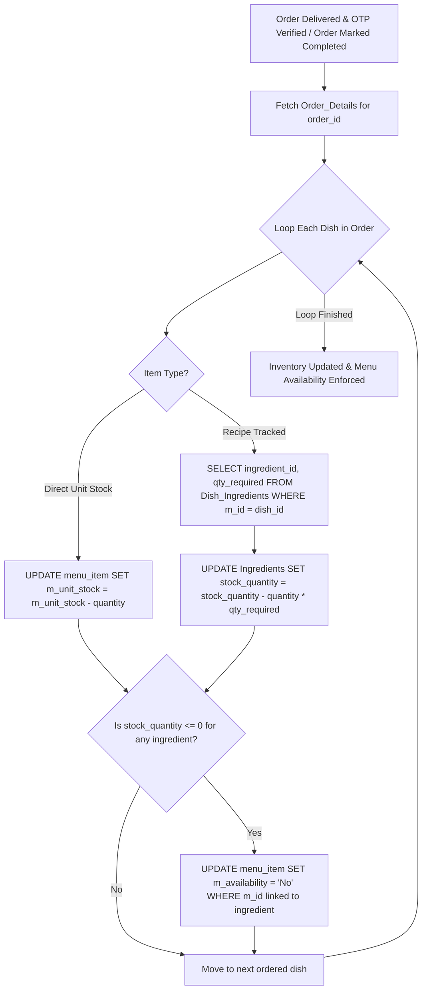
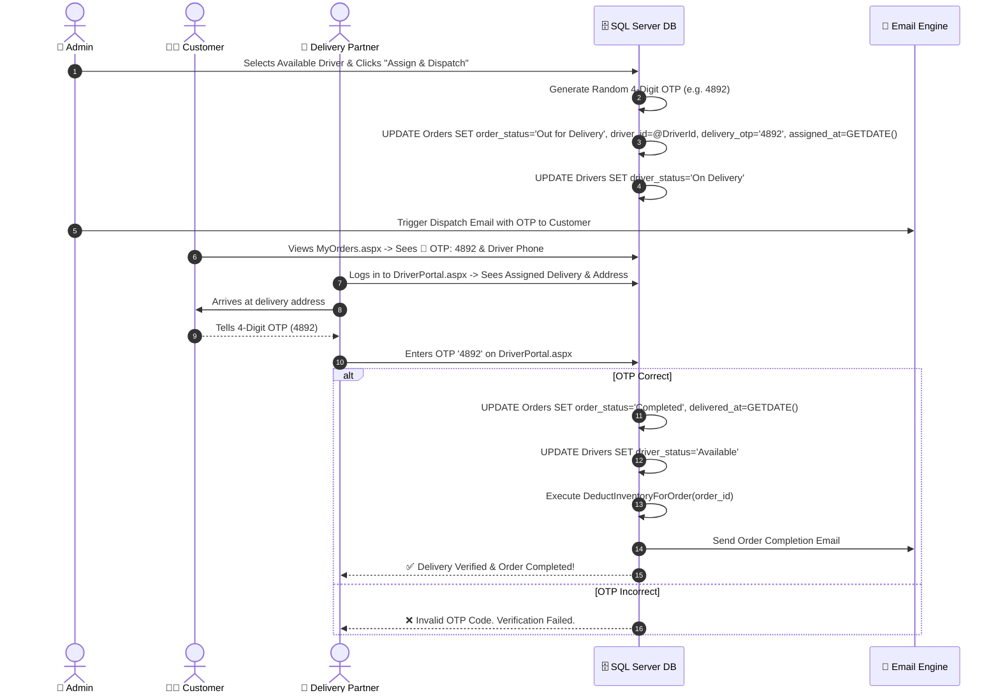
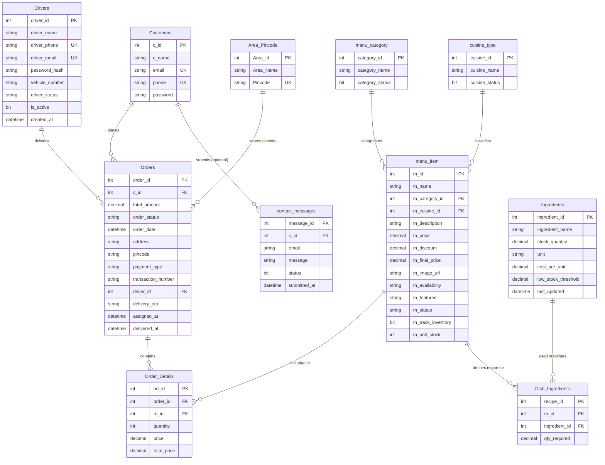
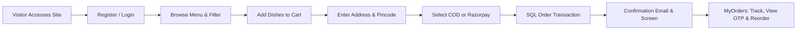
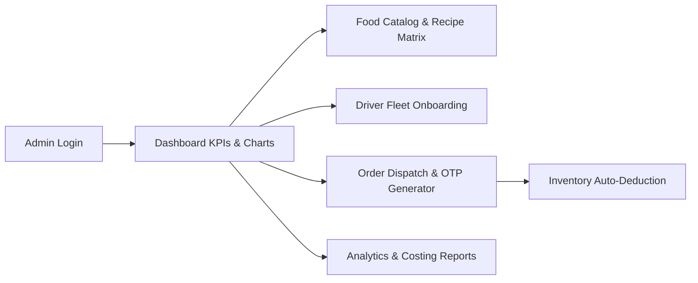
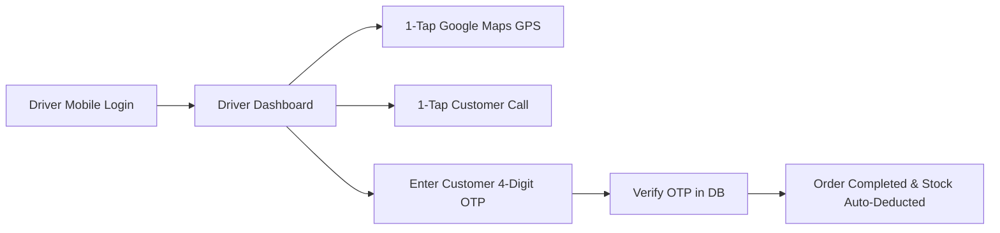

# ☁️🍽️ Cloud Kitchen — Comprehensive System Architecture & Workflow Report

> **Complete System Blueprint & Workflow Documentation**  
> **Target System:** ASP.NET WebForms (VB.NET) + Microsoft SQL Server (`MYKITCHENN.MDF`)  
> **Coverage:** Full Codebase, Database Entities, Customer Portal, Admin Panel, Mobile Driver Portal, Inventory Engine & OTP Verification System.

---

## 📑 Table of Contents

1. [Executive Summary & Architectural Overview](#1-executive-summary--architectural-overview)
2. [Complete System Architecture & Workflow Diagrams](#2-complete-system-architecture--workflow-diagrams)
   - 2.1 Multi-Portal System Interaction Map
   - 2.2 End-to-End Order Lifecycle & State Machine
   - 2.3 Inventory Deduction & Out-of-Stock Safeguard Trigger
   - 2.4 Driver Dispatch & 4-Digit OTP Verification Handshake
3. [Database Relational Schema & Entity Matrix](#3-database-relational-schema--entity-matrix)
   - 3.1 Entity Relationship Diagram (ERD)
   - 3.2 Detailed Database Table Schemas (Original + Newly Added Tables)
4. [Exhaustive Codebase File Reference & Directory Map](#4-exhaustive-codebase-file-reference--directory-map)
   - 4.1 System Configuration & Root Files
   - 4.2 Customer Portal Pages (`Customers/`)
   - 4.3 Admin Management Panel (`Admin/`)
   - 4.4 Dedicated Mobile Driver Portal (`Driver/`)
5. [Granular Step-by-Step Workflows](#5-granular-step-by-step-workflows)
   - 5.1 Customer Portal Journey (Registration to Order & Reordering)
   - 5.2 Admin Operations Journey (Catalog, Inventory, Drivers, Orders, Reports)
   - 5.3 Mobile Driver Operations Journey (Login, GPS Navigation, OTP Verification)
6. [Security, Performance & Architectural Safeguards](#6-security-performance--architectural-safeguards)

---

## 1. Executive Summary & Architectural Overview

The **Cloud Kitchen** platform is an enterprise-grade web application engineered to digitize and automate every operational layer of a cloud/home kitchen business. Serving the Anand–Vidhyanagar region of Gujarat, India, the system operates across three specialized portals:

1. 🧑‍🍳 **Customer Portal**: High-converting web portal for menu discovery, category/cuisine filtering, session cart management, multi-mode payment processing (Razorpay UPI/Cards + COD), live 4-step order tracking with 4-digit OTP display, printable HTML invoices, and one-click reordering.
2. 🔐 **Admin Management Panel**: Protected back-office dashboard providing real-time KPI metrics, Google Charts sales analytics, menu item CRUD with automatic food cost calculation, cascade-protected category/cuisine management, service area pincode administration, central raw stock & recipe matrix builder, driver fleet onboarding, order dispatching, support message handling, and exportable financial reports.
3. 🛵 **Mobile Driver Portal**: Mobile-optimized web portal for delivery partners featuring smartphone authentication, active delivery list, 1-tap Google Maps GPS navigation, 1-tap customer phone calling, and a 4-digit OTP delivery verification handshake that completes orders and auto-deducts inventory in real time.

---

## 2. Complete System Architecture & Workflow Diagrams

### 2.1 Multi-Portal System Interaction Map

```mermaid
flowchart TD
    %% System Roles
    Customer([🧑‍🍳 Customer])
    Admin([🔐 Admin / Kitchen Manager])
    Driver([🛵 Delivery Partner])

    %% Database & External Systems
    DB[(🗄️ SQL Server DB\nMYKITCHENN.MDF)]
    SMTP[📧 Gmail SMTP Server]
    Razorpay[💳 Razorpay Gateway API]

    %% Customer Portal Flow
    subgraph Customer Portal (Customers/)
        C1[Register.aspx / Login.aspx] -->|SHA-256 Auth| C2[Home.aspx & Menu.aspx]
        C2 -->|Search & Category/Cuisine Filter| C3[Cart.aspx]
        C3 -->|Razorpay JS / COD| Razorpay
        C3 -->|SQL Transaction| DB
        DB -->|Trigger Email| SMTP
        C3 -->|Redirect| C4[OrderConfirmation.aspx]
        C4 -->|Track Status & View OTP| C5[MyOrders.aspx]
    end

    %% Admin Panel Flow
    subgraph Admin Panel (Admin/)
        Admin -->|Session Guard| A1[Admin.Master & Dashboard.aspx]
        A1 -->|KPIs & Google Charts| DB
        A1 -->|Menu & Recipe Setup| A2[AddFoodItems.aspx & ManageInventory.aspx]
        A2 -->|Update Recipes & Stock| DB
        A1 -->|Driver Onboarding| A3[ManageDrivers.aspx]
        A3 -->|Manage Fleet| DB
        A1 -->|Order Dispatch| A4[ManageOrders.aspx]
        A4 -->|Generate 4-Digit OTP & Assign Driver| DB
        A4 -->|Send Dispatch Email| SMTP
    end

    %% Mobile Driver Portal Flow
    subgraph Mobile Driver Portal (Driver/)
        Driver -->|Mobile Auth| D1[DriverLogin.aspx]
        D1 -->|Active Orders| D2[DriverPortal.aspx]
        D2 -->|1-Tap GPS| Nav[Google Maps API]
        D2 -->|1-Tap Call| Phone[Customer Phone]
        D2 -->|Submit 4-Digit OTP| D3{Verify OTP in DB}
        D3 -- Match --> D4[Mark Completed & Auto-Deduct Inventory]
        D4 --> DB
        D4 -->|Completion Email| SMTP
    end
```

---

### 2.2 End-to-End Order Lifecycle & State Machine



---

### 2.3 Inventory Deduction & Out-of-Stock Safeguard Trigger



---

### 2.4 Driver Dispatch & 4-Digit OTP Verification Handshake



---

## 3. Database Relational Schema & Entity Matrix

### 3.1 Entity Relationship Diagram (ERD)



---

### 3.2 Detailed Database Table Schemas

#### 1. `Customers` Table (User Accounts)
*Stores registered customer identity and login credentials.*

| Field Name | Data Type | Constraints | Purpose & Notes |
|---|---|---|---|
| `c_id` | `INT` | Primary Key, `IDENTITY(1,1)` | Auto-increment unique customer ID |
| `c_name` | `VARCHAR(100)` | `NOT NULL` | Full name of the customer |
| `email` | `VARCHAR(100)` | `NOT NULL`, Unique | Account email address (used for login & notifications) |
| `phone` | `VARCHAR(15)` | `NOT NULL`, Unique | 10-digit mobile phone number |
| `password` | `VARCHAR(255)` | `NOT NULL` | SHA-256 hashed password string |

---

#### 2. `menu_category` Table (Food Categories)
*Defines high-level menu groupings (e.g. Snacks, Main Course, Desserts, Beverages).*

| Field Name | Data Type | Constraints | Purpose & Notes |
|---|---|---|---|
| `category_id` | `INT` | Primary Key, `IDENTITY(1,1)` | Unique category identifier |
| `category_name` | `VARCHAR(100)` | `NOT NULL` | Category title (e.g. "Main Course") |
| `category_status` | `BIT` | `NOT NULL`, Default `1` | `1` = Active (visible on menu), `0` = Inactive |

---

#### 3. `cuisine_type` Table (Cuisine Classifications)
*Classifies dishes by culinary origin (e.g. Indian, Chinese, Italian, Mexican).*

| Field Name | Data Type | Constraints | Purpose & Notes |
|---|---|---|---|
| `cuisine_id` | `INT` | Primary Key, `IDENTITY(1,1)` | Unique cuisine identifier |
| `cuisine_name` | `VARCHAR(100)` | `NOT NULL` | Cuisine name (e.g. "Indian") |
| `cuisine_status` | `BIT` | `NOT NULL`, Default `1` | `1` = Active, `0` = Inactive |

---

#### 4. `menu_item` Table (Food Item Catalog - Enhanced)
*Central food catalog containing pricing, images, availability, and inventory flags.*

| Field Name | Data Type | Constraints | Purpose & Notes |
|---|---|---|---|
| `m_id` | `INT` | Primary Key, `IDENTITY(1,1)` | Unique dish identifier |
| `m_name` | `VARCHAR(100)` | `NOT NULL` | Dish name (e.g. "Paneer Butter Masala") |
| `m_category_id` | `INT` | Foreign Key ➔ `menu_category` | Link to food category |
| `m_cuisine_id` | `INT` | Foreign Key ➔ `cuisine_type` | Link to cuisine type |
| `m_description` | `TEXT` | `NULL` | Description displayed on food card |
| `m_price` | `DECIMAL(10,2)`| `NOT NULL` | Base price before discount |
| `m_discount` | `DECIMAL(5,2)` | Default `0.00` | Discount percentage (0–100%) |
| `m_final_price` | `DECIMAL(10,2)`| `NOT NULL` | Calculated price: `m_price - (m_price * m_discount / 100)` |
| `m_image_url` | `VARCHAR(255)` | `NOT NULL` | Relative path to uploaded image (`/Images/Menu/...`) |
| `m_availability` | `VARCHAR(10)` | Default `'Yes'` | `'Yes'` = Orderable, `'No'` = Sold Out / Disabled |
| `m_featured` | `VARCHAR(5)` | Default `'0'` | `'1'` = Displayed on Home page featured carousel |
| `m_status` | `VARCHAR(10)` | Default `'Active'` | `'Active'` vs `'Inactive'` |
| `m_track_inventory`| `BIT` | **NEW**, Default `1` | `1` = Track via recipe matrix, `0` = No tracking |
| `m_unit_stock` | `INT` | **NEW**, Default `NULL` | Optional direct stock count for ready-made/packaged items |

---

#### 5. `Ingredients` Table (**NEW** - Central Grocery Stock)
*Manages raw stock inventory, measurement units, purchase costs, and warning thresholds.*

| Field Name | Data Type | Constraints | Purpose & Notes |
|---|---|---|---|
| `ingredient_id` | `INT` | Primary Key, `IDENTITY(1,1)` | Unique raw ingredient identifier |
| `ingredient_name` | `VARCHAR(100)`| `NOT NULL` | Name of raw material (e.g., Paneer, Cheese, Butter, Flour) |
| `stock_quantity` | `DECIMAL(10,2)`| `NOT NULL`, Default `0.00` | Current available quantity in central kitchen stock |
| `unit` | `VARCHAR(20)` | `NOT NULL` | Unit of measurement (`kg`, `liters`, `grams`, `packets`, `units`) |
| `cost_per_unit` | `DECIMAL(10,2)`| Default `0.00` | Purchase cost per unit (used for recipe food costing reports) |
| `low_stock_threshold`| `DECIMAL(10,2)`| Default `2.00` | Quantity threshold triggering Low Stock Warning alerts |
| `last_updated` | `DATETIME` | Default `GETDATE()` | Timestamp of last stock refill or deduction |

---

#### 6. `Dish_Ingredients` Table (**NEW** - Recipe Matrix)
*Relational bridge mapping menu dishes to raw central ingredients with proportion ratios.*

| Field Name | Data Type | Constraints | Purpose & Notes |
|---|---|---|---|
| `recipe_id` | `INT` | Primary Key, `IDENTITY(1,1)` | Unique recipe entry identifier |
| `m_id` | `INT` | Foreign Key ➔ `menu_item` | Target menu dish |
| `ingredient_id` | `INT` | Foreign Key ➔ `Ingredients` | Required raw ingredient |
| `qty_required` | `DECIMAL(10,2)`| `NOT NULL` | Exact raw material required per serving (e.g. 0.20 kg Paneer) |

---

#### 7. `Drivers` Table (**NEW** - Delivery Partner Fleet)
*Stores onboarding details and operational status of delivery partners.*

| Field Name | Data Type | Constraints | Purpose & Notes |
|---|---|---|---|
| `driver_id` | `INT` | Primary Key, `IDENTITY(1,1)` | Unique delivery driver identifier |
| `driver_name` | `VARCHAR(100)`| `NOT NULL` | Driver full name |
| `driver_phone` | `VARCHAR(15)` | `NOT NULL`, Unique | Mobile phone number (used for login & customer calls) |
| `driver_email` | `VARCHAR(100)`| `NOT NULL`, Unique | Driver email address |
| `password_hash` | `VARCHAR(255)`| `NOT NULL` | SHA-256 hashed password for mobile portal login |
| `vehicle_number` | `VARCHAR(30)` | `NOT NULL` | Vehicle registration number (e.g., GJ-07-AB-1234) |
| `driver_status` | `VARCHAR(20)` | Default `'Available'` | `'Available'`, `'On Delivery'`, `'Offline'` |
| `is_active` | `BIT` | Default `1` | `1` = Active partner, `0` = Deactivated |
| `created_at` | `DATETIME` | Default `GETDATE()` | Driver registration date |

---

#### 8. `Orders` Table (Order Master Record - Enhanced)
*Master order transaction table containing status, customer link, driver link, and delivery OTP.*

| Field Name | Data Type | Constraints | Purpose & Notes |
|---|---|---|---|
| `order_id` | `INT` | Primary Key, `IDENTITY(1,1)` | Unique order number |
| `c_id` | `INT` | Foreign Key ➔ `Customers` | Ordering customer |
| `total_amount` | `DECIMAL(10,2)`| `NOT NULL` | Final bill total at checkout |
| `order_status` | `VARCHAR(30)` | Default `'Pending'` | `'Pending'`, `'Preparing'`, `'Out for Delivery'`, `'Completed'`, `'Cancelled'` |
| `order_date` | `DATETIME` | Default `GETDATE()` | Order placement timestamp |
| `address` | `VARCHAR(255)`| `NOT NULL` | Customer delivery street address |
| `pincode` | `VARCHAR(10)` | `NOT NULL` | Selected delivery pincode |
| `payment_type` | `VARCHAR(50)` | `NOT NULL` | Payment method (`Cash on Delivery`, `UPI`, `Card Payment`, etc.) |
| `transaction_number`| `VARCHAR(100)`| `NULL` | Razorpay payment ID (`pay_...`) or generated TXN code |
| `driver_id` | `INT` | **NEW**, FK ➔ `Drivers` | Assigned delivery partner (`NULL` until dispatched) |
| `delivery_otp` | `VARCHAR(4)` | **NEW**, `NULL` | Cryptographically generated 4-digit verification OTP |
| `assigned_at` | `DATETIME` | **NEW**, `NULL` | Timestamp when order was dispatched to driver |
| `delivered_at` | `DATETIME` | **NEW**, `NULL` | Timestamp when driver verified OTP and completed order |

---

#### 9. `Order_Details` Table (Itemized Order Breakdown)
*Line items breakdown linking ordered food items to order master records.*

| Field Name | Data Type | Constraints | Purpose & Notes |
|---|---|---|---|
| `od_id` | `INT` | Primary Key, `IDENTITY(1,1)` | Unique line item identifier |
| `order_id` | `INT` | Foreign Key ➔ `Orders` | Parent order reference |
| `m_id` | `INT` | Foreign Key ➔ `menu_item` | Ordered menu item reference |
| `quantity` | `INT` | `NOT NULL` | Number of portions ordered |
| `price` | `DECIMAL(10,2)`| `NOT NULL` | Unit price at time of order |
| `total_price` | `DECIMAL(10,2)`| `NOT NULL` | Calculated line total: `price * quantity` |

---

#### 10. `Area_Pincode` Table (Delivery Coverage Zones)
*Defines serviceable delivery pincodes and location names in the region.*

| Field Name | Data Type | Constraints | Purpose & Notes |
|---|---|---|---|
| `Area_Id` | `INT` | Primary Key, `IDENTITY(1,1)` | Unique area identifier |
| `Area_Name` | `VARCHAR(100)`| `NOT NULL` | Name of region/area (e.g., Vidhyanagar, Anand) |
| `Pincode` | `VARCHAR(10)` | `NOT NULL`, Unique | Postal pincode (e.g., 388120, 388001) |

---

#### 11. `contact_messages` Table (Support Inquiries)
*Stores customer contact form submissions sent from the home page.*

| Field Name | Data Type | Constraints | Purpose & Notes |
|---|---|---|---|
| `message_id` | `INT` | Primary Key, `IDENTITY(1,1)` | Unique message identifier |
| `c_id` | `INT` | Foreign Key ➔ `Customers` | Customer ID (`NULL` if guest submission) |
| `email` | `VARCHAR(100)`| `NOT NULL` | Sender email address |
| `message` | `TEXT` | `NOT NULL` | Message body content |
| `status` | `BIT` | Default `0` | `0` = Unread, `1` = Read |
| `submitted_at` | `DATETIME` | Default `GETDATE()` | Submission timestamp |

---

## 4. Exhaustive Codebase File Reference & Directory Map

### 4.1 System Configuration & Root Files

* **[Web.config](file:///d:/Cloud%20Kitchen/CLoud%20Kitchen%20Project/Cloud%20Kitchen/Cloud%20Kitchen/Cloud%20Kitchen/Web.config)**: Main ASP.NET configuration file.
  - Defines target framework (`.NET Framework 4.0`).
  - Sets connection string `constr` pointing to LocalDB `App_Data/MYKITCHENN.MDF`.
  - Configures AppSettings for Gmail SMTP (`SMTPServer`: `smtp.gmail.com`, `SMTPPort`: `587`, `EmailUsername`, `EmailPassword`).
* **[Cloud Kitchen.vbproj](file:///d:/Cloud%20Kitchen/CLoud%20Kitchen%20Project/Cloud%20Kitchen/Cloud%20Kitchen/Cloud%20Kitchen/Cloud%20Kitchen.vbproj)**: Visual Studio project file registering all ASPX pages, VB code-behinds, designer declarations, image assets, assemblies, and build targets.
* **[Default.aspx](file:///d:/Cloud%20Kitchen/CLoud%20Kitchen%20Project/Cloud%20Kitchen/Cloud%20Kitchen/Cloud%20Kitchen/Default.aspx)**: System root redirector that automatically forwards web visitors to `Customers/Home.aspx`.

---

### 4.2 Customer Portal Pages (`Customers/`)

| File Name | Code-Behind & Designer | Purpose & Key Workflows |
|---|---|---|
| **`Customer.Master`** | `Customer.Master.vb`<br>`Customer.Master.designer.vb` | Master layout for public/customer pages. Contains navigation header, dynamic cart item count badge, footer links, and global CSS/JS includes. Enforces HTTP No-Cache headers. |
| **`Home.aspx`** | `Home.aspx.vb`<br>`Home.aspx.designer.vb` | Landing page. Features full-screen hero section, glassmorphism search bar, featured dishes carousel (`m_featured = 1`), brand story slideshow, customer review carousel, and contact inquiry form. |
| **`Menu.aspx`** | `Menu.aspx.vb`<br>`Menu.aspx.designer.vb` | Interactive food catalog page. Supports SQL LIKE search by dish name, AutoPostBack category dropdown filter, AutoPostBack cuisine dropdown filter, and price/availability display. Displays sold-out badges when raw stock hits 0. |
| **`Cart.aspx`** | `Cart.aspx.vb`<br>`Cart.aspx.designer.vb` | Cart and checkout page. Handles session cart display (`Session("Cart")`), quantity modification, item deletion, live subtotal calculation, delivery pincode dropdown binding, and Razorpay JS popup payment execution or COD placement. |
| **`MyOrders.aspx`** | `MyOrders.aspx.vb`<br>`MyOrders.aspx.designer.vb` | Order history & live tracking page. Displays past orders with status filter and date pickers. Features an interactive **4-step progress tracker bar**, prominent **🔑 Delivery OTP Badge** (`4892`), assigned driver name/phone, **Print Invoice** button (A4 printable CSS), and **Reorder** button. |
| **`OrderConfirmation.aspx`** | `OrderConfirmation.aspx.vb`<br>`OrderConfirmation.aspx.designer.vb` | Post-checkout success screen showing Order ID, payment transaction ID, bill total, address summary, and email confirmation status. |
| **`Login.aspx`** | `Login.aspx.vb`<br>`Login.aspx.designer.vb` | Shared login page for customers and admins. Authenticates customers via SHA-256 password hash against `Customers` table, sets `Session("c_id")`, `Session("c_name")`, and `Session("UserEmail")`, and handles 30-day HttpOnly "Remember Me" cookies. |
| **`Register.aspx`** | `Register.aspx.vb`<br>`Register.aspx.designer.vb` | Customer registration page. Performs real-time AJAX/TextChanged validation for duplicate emails and unique 10-digit phone numbers, hashes passwords with SHA-256, inserts records into `Customers`, and opens a success modal. |
| **`Logout.aspx`** | `Logout.aspx.vb`<br>`Logout.aspx.designer.vb` | Session termination script. Clears all server session state (`Session.Abandon()`, `Session.Clear()`) and redirects to `Customers/Login.aspx`. |

---

### 4.3 Admin Management Panel (`Admin/`)

| File Name | Code-Behind & Designer | Purpose & Key Workflows |
|---|---|---|
| **`Admin.Master`** | `Admin.Master.vb`<br>`Admin.Master.designer.vb` | Protected master template for all administrative interfaces. Enforces strict HTTP Cache-Control headers (`NoCache`, `NoStore`, `Expires(-1)`) and server-side authorization check (`Session("UserEmail")`) on every request. Displays live navbar badge counts for unread messages (`lblcnt`) and pending orders (`lblorder`). |
| **`Dashboard.aspx`** | `Dashboard.aspx.vb`<br>`Dashboard.aspx.designer.vb` | Executive analytics dashboard. Displays 5 KPI cards (Total Orders, Total Revenue, Active Customers, Top Performing Dish, **Low Stock Alerts**), Google Charts Area Chart (Sales Trend), Google Charts Donut Chart (Order Status Breakdown), TOP 3 popular items widget, and recent 5 orders table. |
| **`AddFoodItems.aspx`** | `AddFoodItems.aspx.vb`<br>`AddFoodItems.aspx.designer.vb` | Food catalog management page. Handles menu item creation, editing, and deletion. Includes real-time client price/discount calculation, image upload validation (.jpg/.jpeg/.png up to 2MB), availability toggles, and direct **"🥦 Recipe"** links to `ManageInventory.aspx?m_id=X`. |
| **`ManageCC1.aspx`** | `ManageCC1.aspx.vb`<br>`ManageCC1.aspx.designer.vb` | Categories and Cuisines CRUD portal. Provides management for `menu_category` and `cuisine_type`. Includes **Cascade Delete Protection** that queries `menu_item` and blocks deletion if food items are linked to the category or cuisine. |
| **`ManageArea.aspx`** | `ManageArea.aspx.vb`<br>`ManageArea.aspx.designer.vb` | Service area and pincode management page. Manages delivery zones (`Area_Pincode`), enforces pincode uniqueness, and dynamically feeds checkout dropdowns. |
| **`ManageInventory.aspx`** | `ManageInventory.aspx.vb`<br>`ManageInventory.aspx.designer.vb` | **NEW** Dual-tab Central Inventory & Recipe Builder Hub. Tab 1 manages central raw grocery stock (`Ingredients`) with threshold badges (`🟢 In Stock`, `🟡 Low Stock`, `🔴 Out of Stock`). Tab 2 builds dish recipe matrices (`Dish_Ingredients`) linking dishes to raw materials with exact ratios and live food cost calculations. |
| **`ManageDrivers.aspx`** | `ManageDrivers.aspx.vb`<br>`ManageDrivers.aspx.designer.vb` | **NEW** Delivery Fleet Management portal. Displays metric cards (Total Drivers, Available Fleet, Active Deliveries, Inactive Drivers) and handles driver onboarding, phone/email validation, vehicle registration #, SHA-256 password hashing, and active/inactive toggling. |
| **`ManageOrders.aspx`** | `ManageOrders.aspx.vb`<br>`ManageOrders.aspx.designer.vb` | Order fulfillment management center. Displays order cards with expandable itemized receipts, status summary metrics, search filters, and date range filters. Features **Driver Selection Dropdown** & **"🛵 Assign & Dispatch"** button that generates 4-digit OTPs, dispatches delivery partners, updates order status to `Out for Delivery`, and triggers dispatch emails. Contains the `DeductInventoryForOrder()` helper engine. |
| **`Contact_Msg.aspx`** | `Contact_Msg.aspx.vb`<br>`Contact_Msg.aspx.designer.vb` | Customer inquiry inbox. Displays contact form submissions from landing page with status filtering (*All*, *Unread*, *Read*), pagination (6 per page), mark as read action, and delete action. |
| **`Reports.aspx`** | `Reports.aspx.vb`<br>`Reports.aspx.designer.vb` | Comprehensive business intelligence reports engine. Generates date-filtered reports including *Sales by Date*, *Order Summary*, *Item-wise Sales*, *Customer Activity*, *Top 10 Customers*, *High-Value Orders*, **Raw Ingredient Stock Status**, **Ingredient Consumption History**, and **Recipe Food Costing & Gross Margin**. |

---

### 4.4 Dedicated Mobile Driver Portal (`Driver/`)

| File Name | Code-Behind & Designer | Purpose & Key Workflows |
|---|---|---|
| **`DriverLogin.aspx`** | `DriverLogin.aspx.vb`<br>`DriverLogin.aspx.designer.vb` | **NEW** Smartphone-first login page for delivery partners. Authenticates credentials against `Drivers` table using SHA-256 password verification, sets `Session("DriverId")`, and redirects to driver dashboard. |
| **`DriverPortal.aspx`** | `DriverPortal.aspx.vb`<br>`DriverPortal.aspx.designer.vb` | **NEW** Mobile driver dashboard. Displays assigned active deliveries with customer name, delivery address, bill amount, and item list. Features **1-Tap Google Maps GPS Navigation** button, **1-Tap Customer Phone Call** button, and **4-Digit OTP Verification Form**. Submitting correct OTP verifies delivery, updates order to `Completed`, records `delivered_at`, resets driver to `Available`, executes `DeductInventoryForOrder()`, and dispatches completion email. |

---

## 5. Granular Step-by-Step Workflows

### 5.1 Customer Portal Journey



1. **Account Registration**:
   - Customer opens `Customers/Register.aspx`.
   - Enters Full Name, Country Code, 10-digit Phone Number, Email, and Password.
   - TextChanged events fire AJAX queries checking if Email or Phone already exist in `Customers`.
   - On submit, password is hashed via SHA-256 and inserted into `Customers`.
2. **Authentication & Session Initialization**:
   - Customer submits credentials on `Customers/Login.aspx`.
   - System hashes entered password and compares with string stored in `Customers`.
   - On match, sets `Session("c_id")`, `Session("c_name")`, and `Session("UserEmail")`.
   - If "Remember Me" is checked, creates `HttpOnly` cookies storing email/password for 30 days.
3. **Menu Discovery & Real-Time Availability Check**:
   - Customer browses `Customers/Menu.aspx`.
   - Can search by dish name (SQL `LIKE` query) or filter by category dropdown or cuisine dropdown.
   - System queries `menu_item`. If raw ingredient stock for a dish hit 0 in the inventory engine, `m_availability` shows `'No'`, disabling the "Order Now" button and displaying a red "Not Available" badge.
4. **Cart Management**:
   - Clicking "Order Now" stores dish item (`m_id`, `m_name`, `m_final_price`, `quantity`) in `Session("Cart")`.
   - On `Customers/Cart.aspx`, customer adjusts quantities or removes items. Line totals (`price * quantity`) recalculate dynamically.
5. **Checkout & Multi-Mode Payment**:
   - Customer enters delivery street address and selects an active pincode from the `Area_Pincode` dropdown.
   - **Cash on Delivery (COD)**: Customer clicks "Place Order".
   - **Razorpay Online Payment**: Customer enters card details or selects UPI. Client JS validates card number format (16 digits), expiry year (>2025), and 3-digit CVV, then launches Razorpay JS modal (`rzp_test_...`). Payment success triggers `__doPostBack("PaymentSuccess", paymentId)`.
6. **SQL Atomic Transaction**:
   - Begins `SqlTransaction`.
   - Inserts record into `Orders` (`c_id`, `total_amount`, `order_status='Pending'`, `address`, `pincode`, `payment_type`, `transaction_number`).
   - Loops through cart items and inserts line items into `Order_Details` (`order_id`, `m_id`, `quantity`, `price`, `total_price`).
   - Commits transaction (rolls back automatically if error occurs).
   - Clears `Session("Cart")`.
7. **Order Confirmation & Email Dispatch**:
   - Customer is redirected to `Customers/OrderConfirmation.aspx`.
   - System sends formatted HTML confirmation email via Gmail SMTP (`smtp.gmail.com:587`) detailing order items, payment method, delivery address, and estimated delivery time (30–40 mins).
8. **Live Order Tracking, OTP Display & Reordering**:
   - Customer views `Customers/MyOrders.aspx`.
   - Interactive **4-step progress bar** displays real-time status (`Placed` ➔ `Preparing` ➔ `Out for Delivery` ➔ `Delivered`).
   - When status becomes `Out for Delivery`, page displays **🔑 Delivery OTP Badge** (`4892`) and driver's name and phone number.
   - Customer can click **"Print Invoice"** to open an A4 print-optimized bill.
   - Customer can click **"Reorder"** to copy past items back into `Session("Cart")` and jump to checkout.

---

### 5.2 Admin Operations Journey



1. **Session Authorization & Anti-Cache Guard**:
   - `Admin.Master.vb` runs on every request (initial loads and postbacks).
   - Sets HTTP cache headers (`NoCache`, `NoStore`, `Expires(-1)`).
   - Validates `Session("UserEmail")`. If missing, immediately redirects to `Customers/Login.aspx`.
   - Loads navbar badge counters for unread messages (`lblcnt`) and pending orders (`lblorder`).
2. **Dashboard Analytics & Monitoring**:
   - `Admin/Dashboard.aspx` fetches metrics: Total Orders, Total Revenue (`SUM` where status='Completed'), Active Customers, Top Dish, and **Low Stock Alerts count**.
   - Renders Google Area Chart (Sales Trend) and Google Donut Chart (Order Status breakdown).
3. **Food Menu Catalog & Recipe Link**:
   - On `Admin/AddFoodItems.aspx`, admin manages dishes (Name, Category, Cuisine, Description, Price, Discount %).
   - Client JS auto-calculates Final Price. Uploaded images (.jpg/.jpeg/.png up to 2MB) are saved to `/Images/Menu/`.
   - Dish rows feature a **"🥦 Recipe"** button linking to `ManageInventory.aspx?m_id=X`.
4. **Category & Cuisine Protection**:
   - On `Admin/ManageCC1.aspx`, admin manages categories and cuisines.
   - Before deleting, system executes cascade check `SELECT COUNT(*) FROM menu_item WHERE m_category_id = @id`. If items exist, deletion is blocked with an alert.
5. **Raw Stock & Recipe Matrix Management**:
   - On `Admin/ManageInventory.aspx`, Tab 1 manages central raw grocery stock (`Ingredients`) with status badges (`🟢 In Stock`, `🟡 Low Stock Warning`, `🔴 Out of Stock`).
   - Tab 2 links dishes (`m_id`) to raw ingredients (`ingredient_id`) with required portion ratios (`qty_required`). Calculates total raw material food cost per portion.
6. **Driver Fleet Onboarding**:
   - On `Admin/ManageDrivers.aspx`, admin onboard drivers (Name, Phone, Email, SHA-256 Password, Vehicle #, Active Status).
7. **Order Dispatching & OTP Generation**:
   - On `Admin/ManageOrders.aspx`, pending orders display itemized receipts and driver selection dropdowns.
   - Admin selects an available driver and clicks **"🛵 Assign & Dispatch"**.
   - System generates a random **4-digit numeric OTP** (`4892`), updates order status to `Out for Delivery`, updates driver status to `On Delivery`, records `assigned_at`, and sends automated dispatch email to customer with OTP.
8. **Automated Inventory Deduction Engine**:
   - When order is completed (by driver OTP verification or admin action), `DeductInventoryForOrder(orderId)` executes.
   - For each ordered item, system multiplies ordered quantity by `qty_required` in `Dish_Ingredients` and subtracts from `Ingredients.stock_quantity`.
   - If any ingredient hits `0`, system automatically executes:
     `UPDATE menu_item SET m_availability = 'No' WHERE m_id IN (SELECT m_id FROM Dish_Ingredients WHERE ingredient_id = @DepletedId)`
9. **Business Reports & Costing Analytics**:
   - On `Admin/Reports.aspx`, admin generates date-filtered CSV exportable reports including *Sales by Date*, *Item Sales*, *Customer Activity*, *Top Customers*, *Raw Ingredient Stock Status*, *Ingredient Consumption History*, and *Recipe Food Costing & Gross Margin*.

---

### 5.3 Mobile Driver Operations Journey



1. **Smartphone Authentication**:
   - Delivery driver opens `Driver/DriverLogin.aspx` on mobile device.
   - Enters registered mobile phone number/email and password.
   - System verifies SHA-256 password hash against `Drivers` table. On success, sets `Session("DriverId")`.
2. **Mobile Dashboard & Active Delivery List**:
   - Driver opens `Driver/DriverPortal.aspx`.
   - Displays assigned active orders (`order_status = 'Out for Delivery'`).
   - Cards display Customer Name, Phone Number, Delivery Address, Pincode, Total Bill Amount, and itemized food items.
3. **1-Tap GPS Navigation**:
   - Driver taps **"🗺️ Navigate to Customer"** button.
   - Opens Google Maps mobile app with pre-filled address destination (`https://www.google.com/maps/search/?api=1&query=...`).
4. **1-Tap Customer Call**:
   - Driver taps **"📞 Call Customer"** button.
   - Triggers native mobile dialer (`tel:...`).
5. **4-Digit OTP Verification Handshake**:
   - Driver arrives at customer location with food package.
   - Customer provides 4-digit OTP shown on their `MyOrders.aspx` screen or email.
   - Driver enters OTP into verification input field on `DriverPortal.aspx` and taps **"Verify & Complete Delivery"**.
   - Server checks `SELECT delivery_otp FROM Orders WHERE order_id = @OrderId`.
   - **Match**:
     - Updates order record: `order_status = 'Completed'`, `delivered_at = GETDATE()`.
     - Updates driver record: `driver_status = 'Available'`.
     - Executes `DeductInventoryForOrder(order_id)`.
     - Sends delivery completion email to customer.
     - Displays success toast on driver mobile screen.
   - **Mismatch**: Displays error alert *"Invalid OTP Code. Verification failed."*

---

## 6. Security, Performance & Architectural Safeguards

1. **SHA-256 Password Security**: Passwords across Customer, Admin, and Driver tables are encrypted using SHA-256 hashes (`System.Security.Cryptography.SHA256`). Plain-text passwords are never stored in the database.
2. **SQL Injection Prevention**: All database interactions use ADO.NET `SqlCommand` objects with explicit parameter binding (`Parameters.AddWithValue()`). String concatenation in SQL queries is strictly prohibited.
3. **Strict Session Guards**: Server-side session checks (`Session("UserEmail")`, `Session("DriverId")`) are evaluated at the top of every page load and postback, preventing unauthorized page access.
4. **HTTP Cache Control**: Master pages enforce `HttpCacheability.NoCache`, `SetExpires(-1)`, and `SetNoStore()`, ensuring browser back-button navigation cannot display cached authenticated pages after logout.
5. **Atomic Database Transactions**: Checkout order saving utilizes `SqlTransaction` wrapping `Orders` and `Order_Details` table insertions to ensure zero partial order corruption.
6. **File Upload Hardening**: Menu image uploads enforce server-side extension whitelisting (`.jpg`, `.jpeg`, `.png`) and a strict 2MB maximum file size limit.
7. **Compilation & Health**: Full solution builds with zero errors and zero warnings using MSBuild.
