# ☁️🍽️ Cloud Kitchen — Practical & Lightweight Future Enhancements Report

> **Target Platform:** ASP.NET WebForms (VB.NET) + SQL Server Cloud Kitchen System  
> **Purpose:** Realistic, lightweight, high-value feature additions suitable for college/BCA projects or practical cloud kitchen business upgrades without overwhelming complexity.  
> **Reference System Document:** [Cloud_Kitchen_Documentation.md](file:///C:/Cloud%20Kitchen/Cloud_Kitchen_Documentation.md)

---

## 📌 Executive Summary

The initial Cloud Kitchen system is already solid with user authentication, food item management, cart processing, Razorpay payment gateway integration, pincode delivery areas, email alerts, and administrative dashboards.

Instead of heavy enterprise features (like AI recommendation engines, microservices, or real-time driver satellite tracking), this report focuses on **10 practical, lightweight, high-impact enhancements**. Each option includes exact **Database Table Schemas**, **User/Admin Workflows**, and **Implementation Steps** tailored specifically to the project's tech stack (ASP.NET WebForms + ADO.NET + SQL Server).

---

## 💡 Top Practical Enhancement Options

```mermaid
graph TD
    SubGraph1[Customer Experience]
    A[1. Promo Codes & Discounts] --> SubGraph1
    B[5. Customer Star Ratings & Reviews] --> SubGraph1
    C[7. Saved Address Book] --> SubGraph1
    D[8. Dish Favorites / Wishlist] --> SubGraph1
    
    SubGraph2[Kitchen & Order Operations]
    E[2. Raw Ingredient Inventory Auto-Deduction] --> SubGraph2
    F[3. Delivery Executive / Driver Assignment] --> SubGraph2
    G[4. Multi-Stage Order Tracking Workflow] --> SubGraph2
    H[6. Live Order Preparation Countdown Timer] --> SubGraph2
    
    SubGraph3[Security & Reporting]
    I[9. COD Email/SMS OTP Verification] --> SubGraph3
    J[10. Admin PDF & Excel Report Exports] --> SubGraph3
```



---

## 🛠️ Feature Breakdown & Technical Specifications

---

### Option 1: 🏷️ Promo Codes & Coupon Discount System *(User Selected Option 3)*

#### 🎯 Why Add It?
Allows admins to launch marketing offers (e.g. `WELCOME50`, `FLAT100`), driving repeat orders and customer engagement.

#### 🗄️ Database Schema (`Coupons`)
```sql
CREATE TABLE Coupons (
    coupon_id INT PRIMARY KEY IDENTITY(1,1),
    coupon_code VARCHAR(20) UNIQUE NOT NULL,    -- e.g. 'OFFER20'
    discount_percent DECIMAL(5,2) DEFAULT 0,    -- e.g. 20.00 (%)
    discount_amount DECIMAL(10,2) DEFAULT 0,     -- e.g. 50.00 (Flat ₹50)
    min_order_amount DECIMAL(10,2) DEFAULT 0,    -- e.g. 200.00
    valid_until DATETIME NOT NULL,
    status BIT DEFAULT 1                         -- 1 = Active, 0 = Inactive
);
```

#### 🔄 How It Works (Workflow):
1. **Admin Side (`ManageCoupons.aspx`)**: Admin creates coupons with minimum cart value and expiry date.
2. **Customer Cart (`Cart.aspx`)**: Customer enters coupon code in a new "Apply Coupon" text field before checkout.
3. **Backend Logic**:
   - System checks code in `Coupons` table where `status = 1` and `valid_until >= GETDATE()`.
   - Verifies if `Cart Total >= min_order_amount`.
   - Calculates discount and subtracts from final total. Stores applied `coupon_code` and `discount_amount` in `Orders` table.

---

### Option 2: 📦 Raw Ingredient Inventory & Stock Management *(User Selected Option 6)*

#### 🎯 Why Add It?
Prevents orders for dishes when raw ingredients (e.g. Paneer, Cheese, Butter) run out, eliminating manual order cancellations.

#### 🗄️ Database Schemas (`Ingredients` & `Dish_Ingredients`)
```sql
-- 1. Raw Ingredients Table
CREATE TABLE Ingredients (
    ingredient_id INT PRIMARY KEY IDENTITY(1,1),
    ingredient_name VARCHAR(100) NOT NULL,       -- e.g. 'Paneer', 'Butter', 'Cheese'
    stock_quantity DECIMAL(10,2) NOT NULL,      -- e.g. 15.50
    unit VARCHAR(20) NOT NULL,                  -- e.g. 'kg', 'liters', 'grams'
    low_stock_threshold DECIMAL(10,2) DEFAULT 2 -- Alert admin when stock < threshold
);

-- 2. Recipe Mapping Table (Mapping food item to ingredients)
CREATE TABLE Dish_Ingredients (
    di_id INT PRIMARY KEY IDENTITY(1,1),
    m_id INT FOREIGN KEY REFERENCES menu_item(m_id),
    ingredient_id INT FOREIGN KEY REFERENCES Ingredients(ingredient_id),
    qty_required DECIMAL(10,2) NOT NULL         -- e.g. 0.200 kg Paneer per Paneer Butter Masala
);
```

#### 🔄 How It Works (Workflow):
1. **Admin Inventory Management**: Admin adds raw items and updates stock when buying fresh groceries.
2. **Auto-Deduction on Order Completion**:
   - When an order is completed, SQL query loops through `Order_Details` and `Dish_Ingredients`:
     `UPDATE Ingredients SET stock_quantity = stock_quantity - (qty_required * order_qty) WHERE ingredient_id = @id`
3. **Auto-Availability Guard**: If any required ingredient stock drops to `0`, system automatically updates dish `m_availability = 'No'` on `Menu.aspx`.

---

### Option 3: 🛵 Delivery Driver Panel & Assignment *(User Selected Option 2)*

#### 🎯 Why Add It?
Assign specific orders to individual delivery boys and allow drivers to update delivery status on their mobile phones.

#### 🗄️ Database Schema (`Delivery_Drivers`)
```sql
CREATE TABLE Delivery_Drivers (
    driver_id INT PRIMARY KEY IDENTITY(1,1),
    driver_name VARCHAR(100) NOT NULL,
    phone VARCHAR(15) UNIQUE NOT NULL,
    vehicle_number VARCHAR(30),
    status VARCHAR(20) DEFAULT 'Available'      -- 'Available', 'On Delivery', 'Off Duty'
);

-- Add Foreign Key to existing Orders table:
ALTER TABLE Orders ADD driver_id INT NULL FOREIGN KEY REFERENCES Delivery_Drivers(driver_id);
```

#### 🔄 How It Works (Workflow):
1. **Admin Order Assignment (`ManageOrders.aspx`)**:
   - Admin views pending orders and selects an available driver from a dropdown list.
   - Clicking "Assign Driver" links `driver_id` to the order and updates driver status to `'On Delivery'`.
2. **Simple Mobile Driver Page (`DriverOrders.aspx`)**:
   - Delivery boy logs in with phone number.
   - Sees list of assigned orders with customer name, phone, delivery address, and COD amount to collect.
   - Clicks **"Mark Delivered"** button -> updates Order status to `Completed` and sends delivery confirmation email to customer.

---

### Option 4: 🔄 Multi-Stage Order Tracking Workflow

#### 🎯 Why Add It?
Instead of a sudden jump from "Pending" to "Completed", customers can watch realistic kitchen preparation stages.

#### 🔄 Order Status Progression:
```
[ Pending ] ──► [ Order Accepted ] ──► [ Cooking in Kitchen ] ──► [ Out for Delivery ] ──► [ Delivered ✅ ]
```

#### 🛠️ Implementation Steps:
1. Modify `Orders.order_status` column values to include: `Accepted`, `Preparing`, `Out for Delivery`, `Completed`, `Cancelled`.
2. **Admin Controls**: In `ManageOrders.aspx`, replace single "Complete" button with dynamic action buttons based on current state:
   - Status = `Pending` -> Show button **"Accept & Cook 🧑‍🍳"**
   - Status = `Preparing` -> Show button **"Out for Delivery 🚚"**
   - Status = `Out for Delivery` -> Show button **"Mark Delivered ✅"**
3. **Customer MyOrders Progress Bar**: Render a visual step-by-step progress bar with Bootstrap badges on `MyOrders.aspx`.

---

### Option 5: ⭐️ Customer Star Ratings & Food Reviews

#### 🎯 Why Add It?
Allows verified customers to post reviews and star ratings (1 to 5 stars) for ordered dishes, building social proof and quality feedback.

#### 🗄️ Database Schema (`Dish_Reviews`)
```sql
CREATE TABLE Dish_Reviews (
    review_id INT PRIMARY KEY IDENTITY(1,1),
    order_id INT FOREIGN KEY REFERENCES Orders(order_id),
    c_id INT FOREIGN KEY REFERENCES Customers(c_id),
    m_id INT FOREIGN KEY REFERENCES menu_item(m_id),
    rating INT CHECK (rating BETWEEN 1 AND 5),  -- 1 to 5 stars
    review_text TEXT NULL,
    created_at DATETIME DEFAULT GETDATE()
);
```

#### 🔄 How It Works (Workflow):
1. **On `MyOrders.aspx`**: Once an order status is `Completed`, a **"Rate Dish ⭐️"** button appears next to each item.
2. Clicking opens a simple rating modal with 5 star icons and a comment box.
3. On submit, saves review to `Dish_Reviews`.
4. **On `Menu.aspx`**: Displays average rating (e.g. `4.7 ★ (12 reviews)`) under dish title on menu cards.

---

### Option 6: ⏱️ Live Preparation Countdown Timer

#### 🎯 Why Add It?
Provides instant feedback to customers on estimated delivery time after order acceptance.

#### 🛠️ Implementation Steps:
1. When admin accepts an order in `ManageOrders.aspx`, admin sets estimated preparation time (e.g. 30 minutes).
2. Stores `estimated_delivery_time = DATEADD(minute, 30, GETDATE())` in `Orders` table.
3. On `OrderConfirmation.aspx` and `MyOrders.aspx`, a JavaScript countdown timer displays live remaining time:
   `"Estimated Delivery: 22 Minutes 14 Seconds Remaining..."`

---

### Option 7: 🏡 Saved Customer Address Book

#### 🎯 Why Add It?
Eliminates typing delivery addresses repeatedly every time a customer orders.

#### 🗄️ Database Schema (`Customer_Addresses`)
```sql
CREATE TABLE Customer_Addresses (
    address_id INT PRIMARY KEY IDENTITY(1,1),
    c_id INT FOREIGN KEY REFERENCES Customers(c_id),
    address_label VARCHAR(30),                  -- e.g. 'Home', 'Office', 'Hostel'
    full_address TEXT NOT NULL,
    pincode VARCHAR(10) NOT NULL
);
```

#### 🔄 How It Works (Workflow):
1. Customer can save labeled addresses in their profile or during checkout.
2. On `Cart.aspx`, checkout displays a radio list of saved addresses (e.g. `🔘 Home: Block A-102, Vidhyanagar`).
3. Selecting a saved address auto-fills address and pincode fields in 1 click.

---

### Option 8: ❤️ Dish Favorites / Wishlist

#### 🎯 Why Add It?
Customers can bookmark their favorite items for quick ordering in future sessions.

#### 🛠️ Implementation Steps:
1. Add table `Customer_Favorites` (`c_id`, `m_id`).
2. On `Menu.aspx`, add a clickable Heart icon ❤️ on each dish card.
3. Clicks toggle favorite status in DB.
4. Add a "Favorites ❤️" tab on `Menu.aspx` to quickly view and add favorite dishes to cart.

---

### Option 9: 🔑 COD Order OTP Email Verification

#### 🎯 Why Add It?
Prevents fake/prank Cash on Delivery (COD) orders by verifying customer intent.

#### 🔄 How It Works (Workflow):
1. Customer selects COD payment on `Cart.aspx` and clicks "Place Order".
2. System generates a 4-digit random OTP and emails it to the customer's registered email via Gmail SMTP.
3. A popup modal requests the 4-digit OTP.
4. Customer enters OTP -> System verifies -> Order is inserted into SQL database.

---

### Option 10: 📄 PDF & Excel Report Exports for Admin (`Reports.aspx`)

#### 🎯 Why Add It?
Enables the admin to export sales summary reports, order histories, and customer lists for offline bookkeeping.

#### 🛠️ Implementation Steps:
1. Add client-side JavaScript libraries on `Reports.aspx`:
   - **SheetJS (`xlsx.full.min.js`)** for Excel exports.
   - **jsPDF (`jspdf.umd.min.js`)** for PDF exports.
2. Add "Export to Excel" and "Export to PDF" buttons above report data tables.
3. Clicking instantly downloads generated `.xlsx` or `.pdf` files without server reload.

---

## 📊 Practical Implementation Complexity Matrix

| Feature | Effort Level | Key Database Addition | Main Value Add |
|---|---|---|---|
| **1. Coupon & Promo Codes** | 🟢 Low (1 Day) | `Coupons` table | Increases customer sales & marketing |
| **2. Ingredient Inventory** | 🟡 Medium (2 Days) | `Ingredients` & `Dish_Ingredients` | Prevents out-of-stock order errors |
| **3. Delivery Driver Panel** | 🟡 Medium (2 Days) | `Delivery_Drivers` table | Simplifies driver delivery assignment |
| **4. Multi-Stage Tracking** | 🟢 Low (0.5 Day) | Update status column values | Realistic kitchen workflow |
| **5. Ratings & Reviews** | 🟡 Medium (1.5 Days) | `Dish_Reviews` table | Social proof & quality customer feedback |
| **6. Preparation Countdown**| 🟢 Low (0.5 Day) | `estimated_delivery_time` | Enhances customer satisfaction |
| **7. Address Book** | 🟢 Low (1 Day) | `Customer_Addresses` table | Faster 1-click checkout |
| **8. Dish Favorites** | 🟢 Low (0.5 Day) | `Customer_Favorites` table | Personalized user experience |
| **9. COD OTP Verification** | 🟢 Low (1 Day) | Session OTP check | Eliminates fake orders |
| **10. PDF/Excel Exports** | 🟢 Low (0.5 Day) | Client JS integration | Professional admin reporting |

---

## 🎓 Recommended Selection for Final Year / BCA Presentation

If selecting features for demonstration or project defense, the top **4 Recommended Additions** are:

1. **Option 1 (Coupons System)** — High visual impact, simple database addition.
2. **Option 2 (Raw Inventory Auto-Deduction)** — Demonstrates advanced relational database logic (foreign key joins, automatic trigger/UPDATE logic).
3. **Option 3 (Delivery Driver Assignment)** — Completes the three-actor ecosystem (*Customer ➔ Admin ➔ Driver*).
4. **Option 5 (Ratings & Reviews)** — Shows full customer feedback lifecycle.

---
*Report generated specifically for Cloud Kitchen ASP.NET WebForms project.*
