# 🎓☁️ Cloud Kitchen — MCA-Level Advanced Future Enhancements Report

> **Target Audience:** Master of Computer Applications (MCA) Final Year Project & Thesis Defense  
> **System Architecture Context:** ASP.NET WebForms / Core (VB.NET/C#) + SQL Server + Distributed AI/ML Services  
> **Documentation Reference:** [Cloud_Kitchen_Documentation.md](file:///C:/Cloud%20Kitchen/Cloud_Kitchen_Documentation.md)

---

## 📌 Executive Summary

For an **MCA (Master of Computer Applications)** level project, evaluators look beyond basic CRUD operations (Create, Read, Update, Delete). They expect **advanced software engineering principles, distributed systems design, Artificial Intelligence/Machine Learning models, real-time bi-directional communication, data analytics, microservice concepts, and robust security architectures**.

This report outlines **10 MCA-grade advanced enhancements** for the Cloud Kitchen platform, complete with technical complexity justifications, architectural designs, algorithms used, and database schemas.

---

## 🧠 MCA Enhancement Roadmap Overview

```mermaid
graph TD
    SubGraph1[AI / Machine Learning Systems]
    A[1. Demand Forecasting & Auto-Procurement] --> SubGraph1
    B[2. Collaborative Filtering Recommendation Engine] --> SubGraph1
    C[3. Computer Vision Kitchen Hygiene & QC Audit] --> SubGraph1
    D[4. Conversational Voice AI Chatbot - Multilingual] --> SubGraph1
    
    SubGraph2[Distributed & Real-Time Engineering]
    E[5. SignalR Real-Time GPS Tracking & Route Optimization] --> SubGraph2
    F[6. Message Queue Event-Driven Architecture - RabbitMQ] --> SubGraph2
    G[7. Real-Time Kitchen Display System KDS & IoT Printers] --> SubGraph2
    
    SubGraph3[Enterprise & SaaS Architecture]
    H[8. Multi-Tenant Cloud Kitchen SaaS Architecture] --> SubGraph3
    I[9. Dynamic Surge Pricing Engine] --> SubGraph3
    J[10. Enterprise Security, Rate Limiting & Audit Suite] --> SubGraph3
```



---

## 🛠️ Detailed MCA-Level Enhancement Specifications

---

### 1. 🤖 AI-Powered Demand Forecasting & Automated Grocery Procurement

#### 🎯 MCA Technical Depth:
* **Domain**: Data Science & Machine Learning / Time-Series Forecasting.
* **Algorithms**: ARIMA, Facebook Prophet, or XGBoost Regression.
* **Concept**: Analyzes historical order trends, day of the week, holidays, season, and weather forecasts to predict dish demand for the upcoming week. It then automatically calculates required raw ingredient quantities and generates vendor purchase orders.

#### 🏗️ Architecture & Flow:
```
[ Orders DB History ] ──► [ Python ML Model (Prophet/XGBoost) ] ──► [ Weekly Demand Forecast ]
                                                                             │
                                                                             ▼
[ Auto Requisition PO ] ◄── [ Recipe Matrix Ingredient Multiplier ] ◄────────┘
```

#### 🗄️ Database Schemas (`Demand_Forecasts` & `Purchase_Orders`):
```sql
CREATE TABLE Demand_Forecasts (
    forecast_id INT PRIMARY KEY IDENTITY(1,1),
    forecast_date DATE NOT NULL,
    m_id INT FOREIGN KEY REFERENCES menu_item(m_id),
    predicted_quantity INT NOT NULL,
    confidence_level DECIMAL(5,2),             -- e.g. 94.50%
    generated_at DATETIME DEFAULT GETDATE()
);

CREATE TABLE Purchase_Orders (
    po_id INT PRIMARY KEY IDENTITY(1,1),
    vendor_name VARCHAR(100),
    total_estimated_cost DECIMAL(10,2),
    status VARCHAR(30) DEFAULT 'Draft',        -- 'Draft', 'Sent to Vendor', 'Fulfilled'
    created_date DATETIME DEFAULT GETDATE()
);
```

---

### 2. ⚡ Real-Time SignalR GPS Tracking & Multi-Stop Route Optimization

#### 🎯 MCA Technical Depth:
* **Domain**: Real-Time Web Communication + Operations Research (Graph Theory).
* **Technologies**: ASP.NET SignalR (WebSockets), Google Maps / Leaflet API, Dijkstra's Algorithm / OR-Tools (Vehicle Routing Problem - VRP).
* **Concept**: Real-time bi-directional socket streaming of driver GPS coordinates to customer maps without page refreshes. If a driver carries 3 orders simultaneously, the system uses the Vehicle Routing Problem (VRP) algorithm to calculate the shortest delivery path.

#### 🔄 Technical SignalR Workflow:
```
[ Driver Mobile App / Web ] ──(WebSocket SignalR Hub)──► [ Customer Track Page Map ]
                                         │
                                         ▼
                            [ VRP Route Optimization ] ──► [ Shortest Delivery Path ]
```

---

### 3. 🧠 Collaborative Filtering Recommendation Engine (Recommender System)

#### 🎯 MCA Technical Depth:
* **Domain**: Machine Learning & Recommender Systems.
* **Algorithms**: Cosine Similarity, Matrix Factorization (SVD - Singular Value Decomposition).
* **Concept**: Analyzes past customer order histories and preferences to build:
  1. **Item-Based Filtering**: "Customers who ordered *Paneer Butter Masala* also frequently ordered *Butter Naan*."
  2. **User-Based Personalization**: Recommends dishes tailored to an individual customer's dietary preferences (e.g. Vegetarian, Jain, High Protein).

---

### 4. 📬 Event-Driven Architecture with Message Queue (RabbitMQ / Kafka)

#### 🎯 MCA Technical Depth:
* **Domain**: Enterprise Software Architecture / Distributed Systems & High Concurrency.
* **Technologies**: RabbitMQ or Apache Kafka + Background Worker Services.
* **Concept**: Decouples heavy background operations (order placement, inventory updating, SMS alerts, payment verification, email dispatches) from the main web server thread. Allows the web application to handle **10,000+ peak concurrent users** during flash sales without database connection pool exhaustion or timeouts.

#### 🏗️ Architecture Diagram:
```
                                ┌──► [ Inventory Service Consumer ]
[ Customer Web Request ]        │
          │                     ├──► [ Email / WhatsApp SMS Consumer ]
          ▼                     │
[ Order Published to RabbitMQ ] ┼──► [ Kitchen Display KDS Consumer ]
                                │
                                └──► [ Analytics Consumer ]
```

---

### 5. 🏢 Multi-Tenant Cloud Kitchen SaaS & Franchise Architecture

#### 🎯 MCA Technical Depth:
* **Domain**: Cloud Computing & SaaS Software Architecture.
* **Concept**: Converts the single-kitchen web app into a **Multi-Tenant SaaS Platform** where multiple cloud kitchen brands (e.g. *Brand A - Biryani House*, *Brand B - Pizza Express*) can manage their menus, pricing, orders, and branch operations under a single platform with strict tenant data isolation.

#### 🗄️ Tenant Isolation Approaches:
1. **Discriminator Column**: Every database table includes a `tenant_id` foreign key.
2. **Schema-per-Tenant**: Separate SQL Server schemas (`TenantA.Orders`, `TenantB.Orders`).

---

### 6. 👁️ Computer Vision Kitchen Hygiene & Quality Assurance Monitoring

#### 🎯 MCA Technical Depth:
* **Domain**: Deep Learning & Computer Vision.
* **Technologies**: Python, OpenCV, YOLO (You Only Look Once) Object Detection model.
* **Concept**: Analyzes live IP camera feeds from the kitchen preparation station. Automatically detects whether kitchen staff are wearing **Hairnets, Face Masks, and Gloves**. If a violation occurs, the system logs an automatic incident alert to the Admin Panel before food dispatch.

---

### 7. 🗣️ Multilingual Conversational Voice AI Chatbot

#### 🎯 MCA Technical Depth:
* **Domain**: Natural Language Processing (NLP) & Conversational AI.
* **Technologies**: OpenAI GPT / Google Gemini API, Web Speech API (Voice-to-Text).
* **Concept**: Allows customers to interact via voice or text in multiple languages (**English, Hindi, Gujarati**). The AI chatbot handles menu queries (*"Is the Paneer Tikka spicy?"*), dietary checks (*"Show me Jain options"*), and guides customers directly to cart checkout.

---

### 8. 📈 Dynamic Pricing & Surge Fee Engine

#### 🎯 MCA Technical Depth:
* **Domain**: Economic Modeling & Dynamic Optimization Algorithms.
* **Concept**: Adjusts delivery fees or item prices in real time based on:
  * **Kitchen Capacity Load**: High pending orders in kitchen ➔ auto-applies small prep delay & surge fee to balance kitchen throughput.
  * **Weather Factors**: Rain/bad weather ➔ increases delivery fee to compensate delivery drivers.
  * **Time-Based Peak Hours**: Lunch (12-3 PM) & Dinner (7-10 PM) surge rates.

---

### 9. 📺 Kitchen Display System (KDS) & IoT Thermal Receipt Printer Integration

#### 🎯 MCA Technical Depth:
* **Domain**: IoT System Integration & Real-Time Event Dispatching.
* **Concept**: Replaces traditional paper kitchen slips with a digital touch-screen KDS for chefs.
* **Features**:
  * Orders split by kitchen station (*Tandoor Station, Curry Station, Beverage Station*).
  * Color-coded SLA timers (Green: < 10 mins, Yellow: 10–18 mins, Red Alert: > 20 mins).
  * Auto-triggers ESC/POS thermal receipt printing upon order confirmation over local network.

---

### 10. 🔐 Enterprise Security, Rate Limiting & PCI-DSS Audit Suite

#### 🎯 MCA Technical Depth:
* **Domain**: Cybersecurity & Application Security Engineering.
* **Features**:
  * **OAuth 2.0 / OpenID Connect**: Single Sign-On via Google & Apple Accounts.
  * **JWT Authentication**: Secure stateless token-based API access.
  * **Rate Limiting (Token Bucket Algorithm)**: Prevents Brute-Force login attacks & DDoS requests.
  * **Immutable Security Audit Log**: Cryptographically hashed audit log tracking all admin data modifications (`admin_id`, `action`, `ip_address`, `timestamp`, `hash_signature`).

---

## 📊 MCA vs BCA Enhancement Comparison Matrix

| Feature | BCA Project Level | MCA Master's Project Level |
|---|---|---|
| **Order Tracking** | Static Status (Pending/Completed) | Real-time SignalR WebSockets + Dijkstra VRP Route Optimization |
| **Inventory** | Manual Stock Decrement | Machine Learning Demand Forecasting (ARIMA/Prophet) + Auto PO |
| **Menu System** | Category & Cuisine Filters | Collaborative Filtering AI Recommendation Engine |
| **Architecture** | Single Monolithic ASP.NET Web App | Event-Driven Architecture (RabbitMQ Queue) + Multi-Tenant SaaS |
| **Security** | Basic SHA-256 Hashing | JWT Token Refresh + OAuth2 SSO + Immutable Hash Audit Logs |
| **User Interface** | Bootstrap 5 Web Interface | Multilingual Voice AI Chatbot + Computer Vision Hygiene QC |

---

## 🎓 Recommended Selection for MCA Final Year Defense

For an impressive MCA final project presentation, select **3 Key Pillars**:

1. **Pillar 1 (Machine Learning)**: Demand Forecasting & Auto-Procurement *(Python ML + Prophet)*.
2. **Pillar 2 (Real-Time Engineering)**: Real-time SignalR Order Tracking & VRP Route Optimization *(WebSockets + Maps API)*.
3. **Pillar 3 (System Architecture)**: Message Queue Decoupling with RabbitMQ & Event-Driven Processing.

---
*Report generated for Cloud Kitchen Master of Computer Applications (MCA) Degree Project.*
