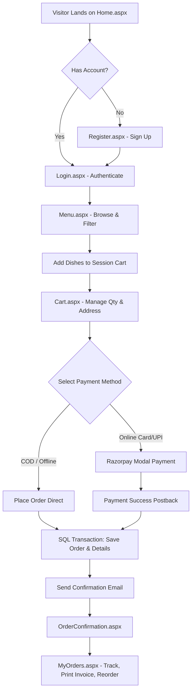
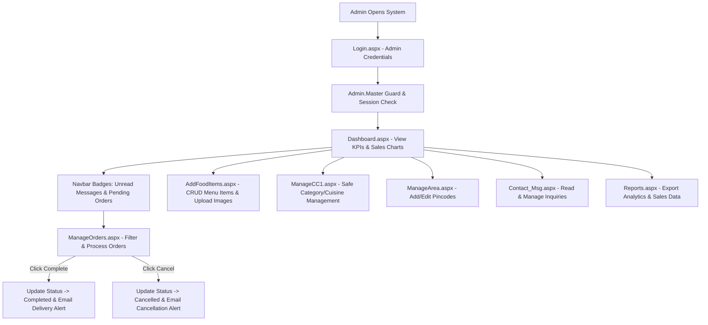

# ☁️🍽️ Cloud Kitchen — System Flow & Future Enhancements Report

> **Prepared for:** Cloud Kitchen Stakeholders & Development Team  
> **Source Project:** ASP.NET WebForms (VB.NET) + SQL Server Cloud Kitchen System  
> **Documentation Reference:** [Cloud_Kitchen_Documentation.md](file:///C:/Cloud%20Kitchen/Cloud_Kitchen_Documentation.md)

---

## 📌 Executive Summary

The **Cloud Kitchen** platform is an end-to-end web application digitizing food ordering, payment processing, delivery mapping, and kitchen operations for the Anand–Vidhyanagar region (Gujarat, India). 

This report provides a step-by-step breakdown of how **Customers** and **Admins** interact with the system, illustrating the complete flow from browsing to fulfillment. Additionally, it provides a feature gap analysis and outlines **Strategic Future Enhancements** to elevate the platform to a modern, enterprise-ready cloud kitchen ecosystem.

---

## 🛠️ System Tech Stack Summary

| Layer | Component | Description |
|---|---|---|
| **Backend** | ASP.NET WebForms (VB.NET) | .NET Framework 4.x code-behind architecture |
| **Database** | SQL Server (`MYKITCHENN.MDF`) | Relational database with parameterized ADO.NET queries |
| **Frontend** | HTML5, CSS3, Bootstrap 5.3 | Glassmorphism UI, Poppins & Cormorant Garamond typography |
| **Payment Gateway** | Razorpay SDK | Online card/UPI payment processing with test key integration |
| **Notifications** | System.Net.Mail (Gmail SMTP) | Automated transactional emails for orders & updates |
| **Security** | SHA-256 Hashing, Session Guards | Password security, HttpOnly cookies, HTTP No-Cache headers |

---

## 🧑‍🍳 Part 1: Step-by-Step Customer Flow

### 1. Account Creation & Registration Flow (`Register.aspx`)
1. **Access Registration**: Customer navigates to `Register.aspx`.
2. **Form Entry**: Enters Full Name, Country Code, Phone Number (10 digits), Email, and Password.
3. **Real-time AJAX/TextChanged Validation**:
   - Checks if Email is already registered in `Customers` table.
   - Checks if Phone Number is 10 digits and unique.
4. **Account Creation**:
   - Password is encrypted using **SHA-256 hashing** (`System.Security.Cryptography`).
   - Customer record is inserted into the `Customers` database table (`c_name`, `email`, `phone`, `password`).
5. **Confirmation**: A bootstrap success modal displays confirmation.

### 2. Authentication & Login Flow (`Login.aspx`)
1. **Login Submission**: Customer inputs Email and Password.
2. **Password Verification**:
   - Input password is hashed via SHA-256 and compared against stored string in `Customers` table.
3. **Session Initialization**:
   - On match, sets `Session("c_id")`, `Session("c_name")`, and `Session("UserEmail")`.
4. **Remember Me Cookie**:
   - If checked, creates `HttpOnly` cookies storing credentials for 30 days. Auto-fills form on return visits.

### 3. Food Browsing & Discovery Flow (`Home.aspx` & `Menu.aspx`)
1. **Landing Page (`Home.aspx`)**:
   - Hero section with glassmorphism search bar.
   - Displays featured items (`m_featured = 1`) dynamically fetched from `menu_item` table.
   - Customer reviews carousel and about section.
2. **Menu Catalog (`Menu.aspx`)**:
   - **Search Bar**: Performs SQL `LIKE` queries on `m_name`.
   - **Category Filter**: Filters dishes by category (e.g., *Snacks, Main Course*).
   - **Cuisine Filter**: Filters by cuisine type (e.g., *Indian, Chinese*).
   - **Availability Check**: Displays active prices and discount rates (`m_final_price`). If item `m_availability = 'No'`, the "Add to Cart" button is hidden, replaced by a "Not Available" badge.

### 4. Cart Management Flow (`Cart.aspx`)
1. **Add to Cart**:
   - Clicking "Order Now" checks session state. If authenticated, stores food items in `Session("Cart")` (a list of key-value dictionaries).
2. **Modify Quantities**:
   - Customer adjusts quantity in cart repeater table. Unit price and line total (`price * quantity`) recalculate dynamically.
3. **Remove Items**: Single-click item removal from session array.

### 5. Checkout & Payment Flow (`Cart.aspx`)
1. **Delivery Information**: Customer enters specific delivery address and selects an active pincode dropdown (populated from `Area_Pincode` table).
2. **Payment Selection**:
   - **Cash on Delivery (COD)**: Customer clicks "Place Order".
   - **Card / UPI / Online Payment**:
     - System performs client-side card validation (16-digit card number, valid expiry date > 2025, 3-digit CVV, cardholder name).
     - Launches **Razorpay Payment Popup Modal** (`rzp_test_...`).
     - Upon payment completion, Razorpay returns a Payment Transaction ID.
     - JS triggers ASP.NET `__doPostBack("PaymentSuccess", paymentId)`.
3. **Database Order Saving (SQL Transaction)**:
   - Starts atomic DB transaction.
   - Inserts record into `Orders` table (`c_id`, `total_amount`, `order_status='Pending'`, `address`, `pincode`, `payment_type`, `transaction_number`).
   - Inserts line items into `Order_Details` table (`order_id`, `m_id`, `quantity`, `price`, `total_price`).
   - Commits transaction (rolls back automatically if any error occurs).
4. **Session Reset**: `Session("Cart")` is cleared.

### 6. Order Confirmation & Email Dispatch (`OrderConfirmation.aspx`)
1. Customer is redirected to `OrderConfirmation.aspx` showing Order ID, Transaction Number, Amount, and Delivery Address.
2. **Automated Confirmation Email**: System dispatches a formatted HTML confirmation email via Gmail SMTP containing order details, estimated delivery time (30–40 mins), and itemized bill.

### 7. Post-Order Management & Reordering (`MyOrders.aspx`)
1. **Order History**: Customer views list of past and active orders with color-coded badges (🟡 Pending, ✅ Completed, ❌ Cancelled).
2. **Filter History**: Filter by order status or custom date ranges.
3. **Printable HTML Invoice**: Clicking "Print Invoice" opens a clean, print-styled modal/window formatted for A4 printing (`window.print()`).
4. **One-Click Reorder**: Clicking "Reorder" reads past line items from `Order_Details`, populates `Session("Cart")`, and redirects directly to `Cart.aspx`.

### 8. Customer Support Inquiry (`Home.aspx` Contact Form)
- Customer fills Name, Email, and Message on landing page.
- Direct insertion into `contact_messages` table for Admin review.

---

## 🔐 Part 2: Step-by-Step Admin Flow

### 1. Admin Authentication & Security Guard (`Admin.Master.vb`)
1. **Shared Login**: Admin logs in via `Login.aspx` using hardcoded administrative credentials (`Admin@gmail.com` / `1234`).
2. **Master Page Security Check**:
   - `Admin.Master.vb` enforces strict HTTP cache prevention (`NoCache`, `NoStore`, `Expires(-1)`).
   - On **EVERY** page request and postback, checks `Session("UserEmail")`. If null or invalid, instantly redirects to `Login.aspx`.
   - Prevents browser "Back" button unauthorized access.

### 2. Dashboard & KPI Monitoring (`Dashboard.aspx`)
1. Admin lands on `Dashboard.aspx` displaying key business indicators:
   - **Total Orders**: SQL `COUNT(*)` from `orders`.
   - **Total Revenue**: SQL `SUM(total_amount)` where status = 'Completed'.
   - **Active Customers**: Distinct count of customer IDs in orders.
   - **Top Performing Dish**: Most ordered dish from `Order_Details`.
2. **Google Charts Analytics**:
   - **Sales Trend Area Chart**: Revenue breakdown grouped by Month & Year.
   - **Order Status Donut Chart**: Proportional split of Pending vs Completed vs Cancelled orders.
3. **Live Navbar Badges**:
   - Unread customer messages count (`lblcnt`).
   - Pending orders awaiting action count (`lblorder`).

### 3. Food Catalog & Menu Item Management (`AddFoodItems.aspx`)
1. **Adding New Items**:
   - Enters Dish Name, selects Category & Cuisine dropdowns.
   - Enters Description, Price, and Discount %.
   - **Auto-Calculated Final Price**: Client-side JS calculates `Final Price = Price - (Price * Discount / 100)`.
   - **Image Upload**: Uploads `.jpg` or `.jpeg` file (Max **2MB**). Image is stored in `/Images/Menu/`.
   - Sets Availability (*Yes/No*), Featured status (*1/0* for Home page display), and Status (*Active/Inactive*).
2. **Editing Items**:
   - Click "Edit" on grid -> Form populates existing data. Supports replacing image or preserving existing file path (`fn.Value`). Supports `.png` uploads during edits.
3. **Deleting Items**: Instant single-click removal from `menu_item` table.
4. **Search & Quick Filters**: Search dishes by name or filter grid view by category.

### 4. Categories & Cuisines Management (`ManageCC1.aspx`)
1. **Safe Category & Cuisine CRUD**:
   - Add/Edit Category Name and Status (*Active/Inactive*).
   - Add/Edit Cuisine Type Name and Status (*Active/Inactive*).
2. **Cascade Delete Protection**:
   - Before deleting any Category or Cuisine, system checks: `SELECT COUNT(*) FROM menu_item WHERE m_category_id = @id`.
   - If food items are linked, deletion is **blocked** with alert: *"Cannot delete category. Menu items exist under this category."*

### 5. Delivery Area & Pincode Management (`ManageArea.aspx`)
1. **Manage Serviceable Pincodes**:
   - Admin defines delivery zones (e.g., *Vidhyanagar - 388120*, *Anand - 388001*).
2. **Validation**:
   - Enforces unique pincode constraint before saving to `Area_Pincode` table.
3. **Impact**:
   - Added pincodes immediately appear in customer checkout dropdown on `Cart.aspx`.

### 6. Order Management & Status Workflow (`ManageOrders.aspx`)
1. **Order Overview**:
   - Displays paginated table (10 orders per page using SQL `ROW_NUMBER()`).
   - Status summary cards (*Pending*, *Completed*, *Cancelled*, *Total*).
   - Search by Order ID, Customer Name, or Phone Number.
   - Date range filters (Default: last 30 days).
2. **Expanding Line Items**: Admin clicks an order row to reveal exact ordered items, quantities, unit prices, delivery address, and payment method.
3. **Fulfillment Actions**:
   - **Click "Complete"**: Updates DB `order_status = 'Completed'`. Triggers automated customer email: *"Your Order #X is Out for Delivery! 🚚"*.
   - **Click "Cancel"**: Updates DB `order_status = 'Cancelled'`. Triggers automated customer email: *"Your Order #X has been Cancelled ❌"*.
   - Status update buttons automatically disappear once order is finalized.

### 7. Support Messages Inbox (`Contact_Msg.aspx`)
1. View customer inquiries submitted from landing page.
2. Filter messages by *All*, *Unread*, or *Read*.
3. Admin clicks "Mark as Read" (updates `status = 1` and decrements navbar unread badge).
4. Delete resolved messages.

### 8. Business Intelligence & Reports (`Reports.aspx`)
1. Access multi-dimensional reports with date filtering:
   - **Sales by Date**: Revenue breakdown over selected dates.
   - **Item-wise Sales Report**: Identifies best-selling & underperforming dishes.
   - **Customer Activity & Top 10 Customers**: Identifies high-value repeat buyers.
   - **Order Status Breakdown**: Visual distribution of fulfillment rates.
   - **High-Value Orders**: Filter top 20 largest single orders.

---

## 📊 Feature Comparison & Gap Analysis

| Feature Category | Current System Capability | Status / Gap |
|---|---|---|
| **Order Statuses** | Pending ➔ Completed / Cancelled | ⚠️ Needs multi-stage tracking (*Preparing, Cooked, Out for Delivery*) |
| **Order Tracking** | Static status in MyOrders + Email | ⚠️ Lacks live map-based driver GPS tracking |
| **Payment Gateway** | Razorpay Test Key + COD | ⚠️ Needs Live Production Keys & Refund processing |
| **Notifications** | Email only (Gmail SMTP) | ⚠️ Lacks SMS / WhatsApp / Web Push notifications |
| **Customer Feedback** | Static review carousel | ⚠️ Lacks star ratings & customer order reviews |
| **Promotions** | Manual item discount % | ⚠️ Lacks promo code / coupon discount engine |
| **Delivery Management**| Area pincodes in dropdown | ⚠️ Lacks dedicated Delivery Executive app/portal |
| **Menu Availability** | Manual Yes/No toggle in Admin | ⚠️ Lacks automated inventory & ingredient stock tracking |
| **User Roles** | Single Admin + Customer accounts | ⚠️ Lacks Role-Based Access Control (Kitchen Staff, Accountant) |

---

## 🚀 Strategic Future Enhancement Ideas

To evolve Cloud Kitchen into a modern enterprise platform, the following features are recommended for future releases:

### 1. 📍 Live GPS Order & Driver Tracking (SignalR / WebSockets)
- **Concept**: Implement real-time order tracking similar to Zomato/Swiggy.
- **Implementation**: Integrate SignalR / WebSockets with Google Maps JS API.
- **Workflow**: 
  - Status updates: *Order Accepted ➔ Being Prepared ➔ Out for Delivery ➔ Delivered*.
  - Live map showing delivery driver moving towards customer location.

### 2. 🛵 Delivery Executive / Driver Dedicated Portal & App
- **Concept**: Provide a lightweight web app or mobile app for delivery drivers.
- **Implementation**: Drivers log in, view assigned orders, update order status on delivery, collect cash for COD, and capture customer signature/OTP confirmation.

### 3. 🏷️ Promo Codes, Coupons & Loyalty Rewards System
- **Concept**: Boost customer retention with dynamic discounts.
- **Features**:
  - Admin creates promo codes (e.g., `FIRST50`, `WEEKEND20`) with start/end dates, usage limits, and minimum order values.
  - **Loyalty Points**: Customers earn 1 point per ₹100 spent, redeemable as wallet cash on future orders.

### 4. ⭐️ Customer Ratings, Reviews & Dish Recommendation Engine
- **Concept**: Allow verified customers to rate dishes (1–5 stars) and post photos after order delivery.
- **AI Recommendation Engine**:
  - Show "Frequently Ordered Together" on cart page.
  - Suggest personalized dishes based on customer order history.

### 5. 📱 Multi-Channel Notifications (SMS, WhatsApp & Web Push)
- **Concept**: Replace email-only alerts with instant messaging.
- **Integrations**: 
  - **Twilio / Fast2SMS API**: Instant SMS alert when order status changes.
  - **WhatsApp Business API**: Send order confirmation & live tracking links directly to WhatsApp.
  - **Web Push Notifications**: Firebase Cloud Messaging (FCM) browser notifications.

### 6. 📦 Inventory & Stock Management System
- **Concept**: Prevent orders for dishes whose ingredients are out of stock.
- **Workflow**:
  - Map menu items to ingredient recipes (e.g., 1 Paneer Butter Masala = 200g Paneer + 50g Butter).
  - Automatically deduct raw ingredient quantities when orders are placed.
  - Auto-set dish availability to "No" when stock drops below threshold.

### 7. ⏱️ Pre-Ordering & Scheduled Order Slot Booking
- **Concept**: Allow customers to schedule food deliveries in advance.
- **Workflow**: Select preferred delivery date and 30-minute time window during checkout (e.g., *Tomorrow at 1:30 PM*).

### 8. 🏢 Multi-Kitchen / Multi-Branch Franchise Support
- **Concept**: Expand beyond Anand-Vidhyanagar to support multiple kitchen branches.
- **Workflow**: Auto-detect customer location via GPS, route order to nearest cloud kitchen branch, and display location-specific menus.

### 9. 🔐 Advanced Role-Based Access Control (RBAC)
- **Concept**: Create granular admin permissions.
- **Roles**:
  - **Super Admin**: Full access (reports, financial data, area management).
  - **Kitchen Chef / Staff**: Only views pending orders and updates preparation status.
  - **Delivery Manager**: Assigns orders to delivery drivers.
  - **Accountant**: Accesses sales reports and payment reconciliations.

### 10. 📲 Progressive Web App (PWA) & Native Mobile App
- **Concept**: Enable offline menu browsing and home-screen app installation without app store friction.
- **PWA Features**: Add to Home Screen prompt, service worker caching for offline menu access, background sync.

---

## 📌 Conclusion & Implementation Roadmap

| Horizon | Focus Area | Key Deliverables |
|---|---|---|
| **Phase 1 (1–2 Months)** | Retention & Marketing | Promo Codes / Coupons system, Customer Dish Ratings & Reviews, SMS API integration. |
| **Phase 2 (3–4 Months)** | Operations & Tracking | Live Order Status Stages (Preparing/Out for Delivery), Delivery Driver Portal, Multi-Admin RBAC. |
| **Phase 3 (5–6 Months)** | Intelligence & Scale | GPS Driver Tracking on Map, Inventory/Stock Auto-deduction, PWA mobile support. |

---
*Report generated automatically from Cloud Kitchen project repository analysis.*
