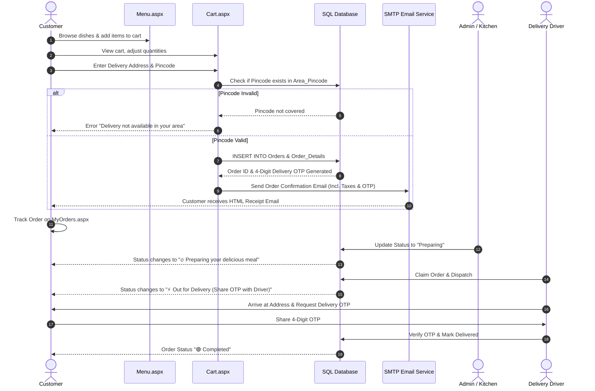

# 🛒 Customer Entity Workflow & Documentation

## 1. Overview & Role Definition
The **Customer Entity** represents end-users ordering food from the Cloud Kitchen web application. Customers interact with the public storefront to explore food items, manage shopping carts, select valid delivery pincodes, place orders, track live preparation/delivery statuses, and receive email notifications.

---

## 2. Customer Features & Responsibilities

| Feature / Action | Description | Page / File |
| :--- | :--- | :--- |
| **Registration & Authentication** | Create account with full name, email, password, and contact phone. Persistent login session via cookies. | `Register.aspx`, `Login.aspx`, `CookieHelper.vb` |
| **Menu Exploration** | Search food dishes, filter by food category (Veg/Non-Veg/Snacks/Beverages), view prices & images. | `Menu.aspx`, `Home.aspx` |
| **Cart Management** | Add dishes, adjust item quantities, compute subtotal & total amount (incl. of all taxes & GST). | `Cart.aspx`, `Cart.aspx.vb` |
| **Delivery Pincode Validation** | Verify if customer's delivery area/pincode is active in `Area_Pincode`. | `Cart.aspx.vb` |
| **Order Checkout & Placement** | Enter delivery address, select payment mode (Cash on Delivery / Online), auto-generate 4-digit Delivery OTP. | `Cart.aspx.vb`, `Orders` table |
| **Order Confirmation & Email** | View order summary page, thermal receipt format, and receive HTML invoice email. | `OrderConfirmation.aspx`, `Cart.aspx.vb` |
| **Live Order Tracking** | View real-time status updates (*Pending*, *Preparing*, *Finding Driver*, *Out for Delivery*, *Completed*). | `MyOrders.aspx`, `MyOrders.aspx.vb` |

---

## 3. End-to-End Customer Lifecycle Workflow

---

## 4. Key Security & Business Logic Rules

1. **Inclusive Pricing & Tax Policy**:
   - Menu item prices are **inclusive of all taxes and GST**.
   - No additional 5% tax surcharge is appended at checkout.
   - Bills and confirmation emails explicitly display `(Incl. of all taxes & GST)`.

2. **Pincode Verification**:
   - Checkout is blocked if the entered 6-digit postal pincode does not exist in `Area_Pincode`.

3. **Delivery OTP Security**:
   - A random 4-digit numeric OTP (`delivery_otp`) is generated upon order placement.
   - Customers must keep the OTP confidential and provide it only to the assigned delivery driver upon arrival.

4. **Session Management**:
   - `CookieHelper.vb` maintains user session state across page reloads. If a customer logs out (`Logout.aspx`), session cookies are cleared.

---

## 5. Summary of Customer Database Fields

- **`customers`**: `c_id` (PK), `c_name`, `email`, `password`, `phone_no`, `address`.
- **`orders`**: `order_id` (PK), `c_id` (FK), `total_amount`, `order_status`, `order_date`, `delivery_otp`, `driver_id` (FK).
- **`order_details`**: `order_detail_id` (PK), `order_id` (FK), `m_id` (FK), `quantity`, `price`.
