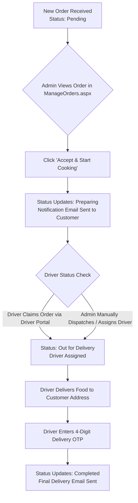

# 👑 Admin Entity Workflow & Documentation

## 1. Overview & Role Definition
The **Admin Entity** represents the Cloud Kitchen owner, kitchen manager, and operations staff. The Admin possesses full control over kitchen status, order lifecycle, menu management, ingredient inventory levels, service area pincodes, delivery driver assignments, and business analytics.

---

## 2. Admin Modules & Page Responsibilities

| Module | Purpose & Actions | Primary ASP.NET Page |
| :--- | :--- | :--- |
| **Real-Time Dashboard** | View live revenue, order counts, active customer stats, top selling dish, low stock warnings, sales trends, and recent order stream without inner scrollbars. | `Dashboard.aspx` |
| **Food Menu Management** | Create new dishes with images (`AddFoodItems.aspx`), edit item prices, availability flags, and category assignments (`ManageCC1.aspx`). | `AddFoodItems.aspx`, `ManageCC1.aspx` |
| **Inventory & Stock Control** | Monitor raw ingredients (`Ingredients` table), manage stock quantities, set safety thresholds, and trigger restock alerts. | `ManageInventory.aspx` |
| **Kitchen Workflow & Orders** | View detailed order cards, customer info, delivery address, ordered items list, print thermal invoices, accept/start cooking, assign drivers, or mark completed. | `ManageOrders.aspx` |
| **Service Area Configuration** | Manage active delivery zones & 6-digit pincodes (`Area_Pincode`), edit area details, search pincodes, and delete areas using a sleek custom modal dialog. | `ManageArea.aspx` |
| **Delivery Partner Pool** | Add/Edit delivery drivers (`Drivers`), assign vehicle numbers, track online/available statuses, and review claimed orders. | `ManageDrivers.aspx` |
| **Contact Messages** | Read customer inquiries/feedbacks and send direct responses. | `Contact_Msg.aspx` |
| **Business Reports** | Export sales reports, revenue trends, and historical analytics. | `Reports.aspx` |

---

## 3. Kitchen Order Preparation & Dispatch Lifecycle Workflow

---

## 4. Operational & Design System Standards

1. **Order Detail Layout**:
   - **`KITCHEN WORKFLOW ACTIONS`** is positioned at the top of the detail pane for 1-click access to driver status, delivery OTP, and action controls without scrolling.

2. **Price & Tax Consistency**:
   - Admin panel order totals strictly mirror `Orders.total_amount` (e.g. ₹900.00).
   - GST is **inclusive** within item pricing. No 5% surcharge is added on top.
   - Thermal invoice generator (`printThermalInvoice()`) prints `TOTAL AMOUNT: ₹900.00 (Incl. of all taxes & GST)`.

3. **Service Area Management**:
   - Deletion of delivery zones utilizes a custom glassmorphism modal dialog (`#deleteModalOverlay`) with dark backdrop blur and red warning accent instead of generic browser alerts.

4. **Navigation Structure**:
   - `Manage Inventory` is positioned as a main top-level sidebar item directly under `Food Menu` for 1-click stock tracking.

---

## 5. Summary of Admin-Managed Database Tables

- **`menu_item`**: `m_id` (PK), `m_name`, `m_price`, `m_category`, `m_image_url`, `is_available`.
- **`Ingredients`**: `ingredient_id` (PK), `ingredient_name`, `stock_quantity`, `unit`, `low_stock_threshold`.
- **`Area_Pincode`**: `Area_Id` (PK), `Area_Name`, `Pincode`.
- **`Drivers`**: `driver_id` (PK), `driver_name`, `phone_no`, `vehicle_no`, `status`.
- **`Messages`**: `msg_id` (PK), `c_name`, `email`, `subject`, `message`, `submitted_at`.
