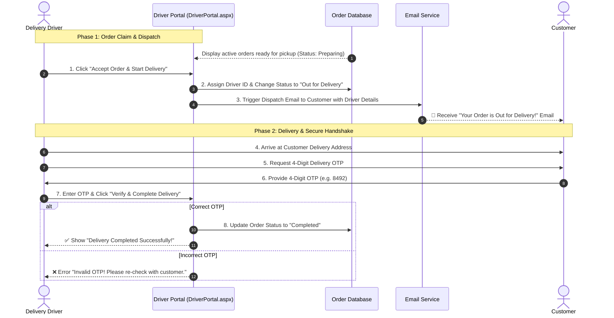

# 🛵 Delivery Driver Entity Workflow & Documentation

## 1. Overview & Role Definition
The **Delivery Driver Entity** represents delivery partners responsible for claiming orders from the kitchen pool, navigating to customer delivery addresses, verifying delivery using a secure 4-digit OTP, and completing order handoffs.

---

## 2. Driver Features & Responsibilities

| Feature / Action | Description | Page / File |
| :--- | :--- | :--- |
| **Driver Login & Portal** | Authenticate via driver login credentials and access the driver control panel. | `DriverLogin.aspx`, `DriverPortal.aspx` |
| **Live Order Pool View** | View available kitchen orders in *Preparing* or *Pending* states ready for delivery. | `DriverPortal.aspx`, `DriverPortal.aspx.vb` |
| **Claiming & Accepting Orders** | Click "Accept Order" to claim an unassigned order from the pool. Automatically assigns `driver_id` and sets status to *Out for Delivery*. | `DriverPortal.aspx.vb` |
| **Customer Contact & Address** | Access customer full name, delivery address, phone number link (`tel:`), and order item breakdown. | `DriverPortal.aspx` |
| **Automated Dispatch Email** | Trigger automatic delivery dispatch email to the customer when driver claims order or arrives. | `DriverPortal.aspx.vb` |
| **OTP Delivery Verification** | Prompt customer for 4-digit Delivery OTP (`delivery_otp`) and enter it into `txtOTP` field for verification. | `DriverPortal.aspx`, `DriverPortal.aspx.vb` |
| **Mark Order Delivered** | Upon valid OTP verification, update order status to *Completed*, clear active assignment, and mark driver as available. | `DriverPortal.aspx.vb` |

---

## 3. Delivery Driver Order Dispatch & Verification Workflow

---

## 4. Business Logic & Security Enforcements

1. **Premature Email Prevention**:
   - Dispatch emails are NOT sent when an order is still being cooked (*Preparing*).
   - Email is triggered ONLY when a driver claims the order or when the admin explicitly dispatches it.

2. **Driver Assignment Locking**:
   - Once a driver claims an order, no other driver can accept or modify that order.
   - The driver's name and vehicle number are saved in `orders.driver_id` and displayed on `ManageOrders.aspx` and customer tracking pages.

3. **Secure Handshake (Delivery OTP)**:
   - The order cannot be marked *Completed* without entering the exact 4-digit `delivery_otp` matching `orders.delivery_otp`.

---

## 5. Summary of Driver Database Fields

- **`Drivers`**: `driver_id` (PK), `driver_name`, `phone_no`, `vehicle_no`, `status`.
- **`orders`**: `order_id` (PK), `driver_id` (FK to `Drivers`), `order_status`, `delivery_otp`.
