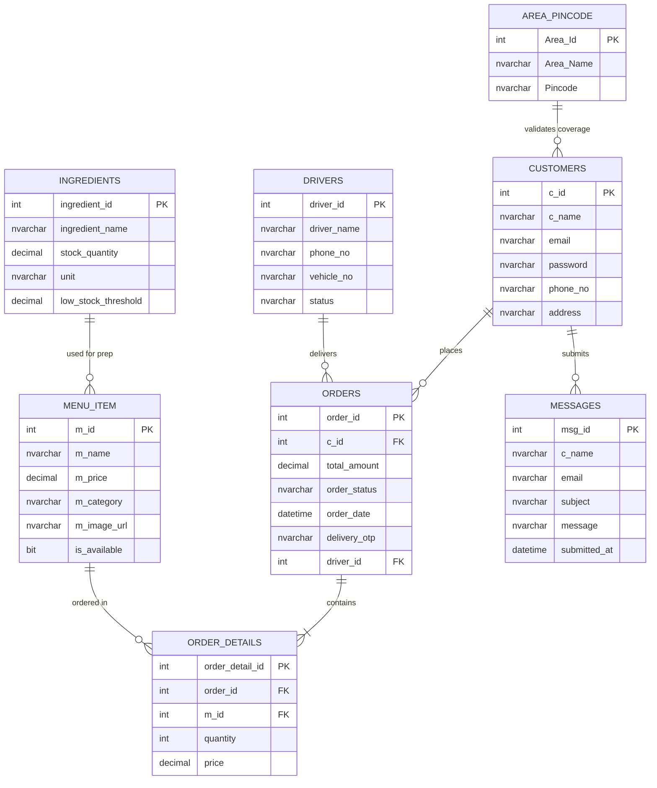

# 🗄️ Database Entities, Schema Architecture & Business Rules

## 1. Overview
The **Cloud Kitchen Database System** is built on Microsoft SQL Server (`MSSQLLocalDB`). It manages user accounts, menu items, raw ingredient inventories, order transactions, pincode delivery coverage, driver assignments, and customer feedback messages.

- **Connection String Key**: `constr`
- **Database File**: `MyKitchenn.mdf`
- **Default DataSource**: `(LocalDB)\MSSQLLocalDB;AttachDbFilename=|DataDirectory|\MyKitchenn.mdf;Integrated Security=True`

---

## 2. Entity Relationship Diagram (ERD)

---

## 3. Comprehensive Database Table Specs

### 3.1 `customers` Table
Stores registered customer credentials, contact details, and default shipping address.

| Column Name | Data Type | Constraints | Description |
| :--- | :--- | :--- | :--- |
| `c_id` | `INT` | Primary Key, Identity(1,1) | Unique customer identifier |
| `c_name` | `NVARCHAR(100)` | NOT NULL | Customer full name |
| `email` | `NVARCHAR(100)` | UNIQUE, NOT NULL | Login email address |
| `password` | `NVARCHAR(100)` | NOT NULL | Account password |
| `phone_no` | `NVARCHAR(20)` | NOT NULL | Mobile contact number |
| `address` | `NVARCHAR(MAX)` | NULL | Primary delivery address |

---

### 3.2 `orders` Table
Master table for all customer orders placed in the system.

| Column Name | Data Type | Constraints | Description |
| :--- | :--- | :--- | :--- |
| `order_id` | `INT` | Primary Key, Identity(1,1) | Unique order number |
| `c_id` | `INT` | Foreign Key -> `customers(c_id)` | Customer who placed order |
| `total_amount` | `DECIMAL(18,2)` | NOT NULL | Net order total (Incl. of all taxes & GST) |
| `order_status` | `NVARCHAR(50)` | NOT NULL | *Pending*, *Preparing*, *Out for Delivery*, *Completed*, *Cancelled* |
| `order_date` | `DATETIME` | Default: `GETDATE()` | Order placement timestamp |
| `delivery_otp` | `NVARCHAR(10)` | NOT NULL | Random 4-digit security OTP |
| `driver_id` | `INT` | Foreign Key -> `Drivers(driver_id)` | Assigned delivery driver ID |

---

### 3.3 `order_details` Table
Line items associated with each order transaction.

| Column Name | Data Type | Constraints | Description |
| :--- | :--- | :--- | :--- |
| `order_detail_id` | `INT` | Primary Key, Identity(1,1) | Unique detail line ID |
| `order_id` | `INT` | Foreign Key -> `orders(order_id)` | Parent order reference |
| `m_id` | `INT` | Foreign Key -> `menu_item(m_id)` | Ordered dish reference |
| `quantity` | `INT` | NOT NULL | Quantity ordered |
| `price` | `DECIMAL(18,2)` | NOT NULL | Price per item at purchase |

---

### 3.4 `menu_item` Table
Food dishes available on the Cloud Kitchen storefront.

| Column Name | Data Type | Constraints | Description |
| :--- | :--- | :--- | :--- |
| `m_id` | `INT` | Primary Key, Identity(1,1) | Unique dish ID |
| `m_name` | `NVARCHAR(100)` | NOT NULL | Dish title |
| `m_price` | `DECIMAL(18,2)` | NOT NULL | Unit price (Incl. taxes) |
| `m_category` | `NVARCHAR(50)` | NOT NULL | *Veg*, *Non-Veg*, *Snacks*, *Beverages*, *Dessert* |
| `m_image_url` | `NVARCHAR(MAX)` | NULL | Relative path to dish image |
| `is_available` | `BIT` | Default: `1` | Menu visibility flag |

---

### 3.5 `Ingredients` Table
Raw kitchen stock and inventory management items.

| Column Name | Data Type | Constraints | Description |
| :--- | :--- | :--- | :--- |
| `ingredient_id` | `INT` | Primary Key, Identity(1,1) | Unique ingredient ID |
| `ingredient_name` | `NVARCHAR(100)` | NOT NULL | Ingredient name (e.g. Paneer, Butter, Flour) |
| `stock_quantity` | `DECIMAL(18,2)` | NOT NULL | Current physical stock count |
| `unit` | `NVARCHAR(20)` | NOT NULL | Unit of measure (`kg`, `grams`, `litres`, `units`) |
| `low_stock_threshold` | `DECIMAL(18,2)` | NOT NULL | Alert trigger threshold |

---

### 3.6 `Area_Pincode` Table
Active delivery coverage zones and 6-digit postal pincodes.

| Column Name | Data Type | Constraints | Description |
| :--- | :--- | :--- | :--- |
| `Area_Id` | `INT` | Primary Key, Identity(1,1) | Unique area ID |
| `Area_Name` | `NVARCHAR(100)` | NOT NULL | Service location name (e.g. Anand, Bakrol) |
| `Pincode` | `NVARCHAR(10)` | NOT NULL | 6-Digit postal code (e.g. 388120) |

---

### 3.7 `Drivers` Table
Registered delivery partners pool.

| Column Name | Data Type | Constraints | Description |
| :--- | :--- | :--- | :--- |
| `driver_id` | `INT` | Primary Key, Identity(1,1) | Unique driver ID |
| `driver_name` | `NVARCHAR(100)` | NOT NULL | Driver full name |
| `phone_no` | `NVARCHAR(20)` | NOT NULL | Driver mobile number |
| `vehicle_no` | `NVARCHAR(50)` | NOT NULL | Vehicle registration number (e.g. GJ-23-AB-1234) |
| `status` | `NVARCHAR(20)` | Default: `'Available'` | *Available*, *On Delivery*, *Offline* |

---

## 4. Key Financial & System Rules

1. **Inclusive Tax Calculation**:
   - `orders.total_amount = SUM(quantity * price)` across all cart line items.
   - Prices listed on `menu_item` and charged to customers are **inclusive of all taxes and GST**.
   - No separate GST row or 5% tax surcharge is added into `orders.total_amount`.

2. **Order Status Lifecycle Enums**:
   - `Pending` ➔ Initial state when order is placed by customer.
   - `Preparing` ➔ Kitchen admin accepts order and starts cooking.
   - `Out for Delivery` ➔ Driver claims order or admin dispatches order.
   - `Completed` ➔ Driver enters matching 4-digit `delivery_otp`.
   - `Cancelled` ➔ Order rejected or cancelled by admin/customer.
