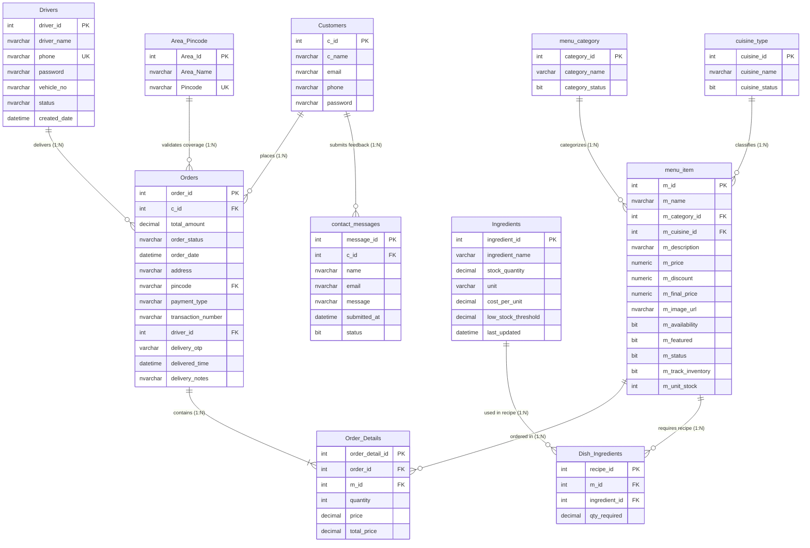

# 🗄️ All 11 Database Tables & Schema Architecture Documentation

## 1. System Overview & Connection Details
The **Cloud Kitchen Database System** is implemented using Microsoft SQL Server (`MSSQLLocalDB`). It consists of **11 core database tables** that manage customer accounts, menu items, categories, cuisines, raw ingredient stock, dish recipe mappings, order transactions, order details, pincode delivery coverage, driver tracking, and contact messages.

- **Connection String Key**: `constr`
- **Database File**: `MyKitchenn.mdf`
- **Data Source**: `(LocalDB)\MSSQLLocalDB;AttachDbFilename=|DataDirectory|\MyKitchenn.mdf;Integrated Security=True`

---

## 2. Complete Entity Relationship Diagram (ERD)

---

## 3. Comprehensive Breakdown of All 11 Tables

---

### 3.1 `Customers` Table
Stores registered customer credentials, contact information, and hashed passwords.

| Column Name | Data Type | Nullable | Key / Constraint | Default Value | Description |
| :--- | :--- | :--- | :--- | :--- | :--- |
| `c_id` | `INT` | NO | **Primary Key**, IDENTITY(1,1) | Auto-increment | Unique customer account ID |
| `c_name` | `NVARCHAR(50)` | NO | None | None | Customer full name |
| `email` | `NVARCHAR(40)` | NO | None | None | Primary login email address |
| `phone` | `NVARCHAR(13)` | NO | None | None | Contact mobile number (e.g. `+918160698196`) |
| `password` | `NVARCHAR(256)`| NO | None | None | SHA256 hashed password string |

---

### 3.2 `Orders` Table
Master transaction table for customer food orders, driver assignments, delivery status, address, pincode, and security OTP.

| Column Name | Data Type | Nullable | Key / Constraint | Default Value | Description |
| :--- | :--- | :--- | :--- | :--- | :--- |
| `order_id` | `INT` | NO | **Primary Key**, IDENTITY(1,1) | Auto-increment | Unique order receipt number |
| `c_id` | `INT` | NO | Foreign Key -> `Customers(c_id)` | None | Customer who placed order |
| `total_amount` | `DECIMAL(10,2)`| NO | None | None | Net bill total (Incl. of all taxes & GST) |
| `order_status` | `NVARCHAR(50)` | YES | Enum (`Pending`, `Preparing`, `Out for Delivery`, `Completed`, `Cancelled`) | `'Pending'` | Current kitchen/delivery status |
| `order_date` | `DATETIME` | YES | None | `getdate()` | Timestamp when order was placed |
| `address` | `NVARCHAR(255)`| NO | None | None | Street delivery address |
| `pincode` | `NVARCHAR(10)` | NO | Foreign Key -> `Area_Pincode(Pincode)` | None | 6-Digit delivery postal pincode |
| `payment_type` | `NVARCHAR(50)` | NO | None | None | Payment mode (`Cash on Delivery`, `Razorpay`, `UPI Payment`) |
| `transaction_number` | `NVARCHAR(50)` | YES | None | NULL | Online gateway payment reference ID |
| `driver_id` | `INT` | YES | Foreign Key -> `Drivers(driver_id)` | NULL | Assigned delivery driver ID |
| `delivery_otp` | `VARCHAR(6)` | YES | None | NULL | Secure 4-digit OTP for delivery handshake |
| `delivered_time` | `DATETIME` | YES | None | NULL | Timestamp when order marked completed |
| `delivery_notes` | `NVARCHAR(255)`| YES | None | NULL | Special instructions for delivery driver |

---

### 3.3 `Order_Details` Table
Line items associated with each order, tracking quantity, unit price, and subtotal amount per dish.

| Column Name | Data Type | Nullable | Key / Constraint | Default Value | Description |
| :--- | :--- | :--- | :--- | :--- | :--- |
| `order_detail_id` | `INT` | NO | **Primary Key**, IDENTITY(1,1) | Auto-increment | Unique line item detail ID |
| `order_id` | `INT` | NO | Foreign Key -> `Orders(order_id)` | None | Parent order reference |
| `m_id` | `INT` | NO | Foreign Key -> `menu_item(m_id)` | None | Ordered food dish reference |
| `quantity` | `INT` | NO | None | None | Quantity of dish ordered |
| `price` | `DECIMAL(10,2)`| NO | None | None | Price per dish unit at checkout |
| `total_price` | `DECIMAL(10,2)`| NO | None | None | Calculated subtotal (`quantity * price`) |

---

### 3.4 `menu_item` Table
Food dishes available on the Cloud Kitchen storefront, including category, cuisine, pricing, discount, and availability.

| Column Name | Data Type | Nullable | Key / Constraint | Default Value | Description |
| :--- | :--- | :--- | :--- | :--- | :--- |
| `m_id` | `INT` | NO | **Primary Key**, IDENTITY(1,1) | Auto-increment | Unique food item ID |
| `m_name` | `NVARCHAR(100)`| NO | None | None | Food dish name (e.g. *Paneer Butter Masala*) |
| `m_category_id` | `INT` | NO | Foreign Key -> `menu_category(category_id)` | None | Food category reference ID |
| `m_cuisine_id` | `INT` | NO | Foreign Key -> `cuisine_type(cuisine_id)` | None | Regional cuisine reference ID |
| `m_description` | `NVARCHAR(255)`| YES | None | NULL | Dish description and ingredients summary |
| `m_price` | `NUMERIC(6,2)` | NO | None | None | Base menu list price |
| `m_discount` | `NUMERIC(5,2)` | YES | None | `0.00` | Percentage discount applied |
| `m_final_price` | `NUMERIC(6,2)` | YES | None | Computed | Selling price after discount |
| `m_image_url` | `NVARCHAR(255)`| YES | None | NULL | Relative image file path |
| `m_availability` | `BIT` | NO | Flag (`1` = Available, `0` = Sold Out) | `1` | Menu visibility flag |
| `m_featured` | `BIT` | NO | Flag (`1` = Featured, `0` = Regular) | `0` | Featured dish carousel flag |
| `m_status` | `BIT` | NO | Flag (`1` = Active, `0` = Soft Deleted) | `1` | Active item status |
| `m_track_inventory` | `BIT` | YES | Flag (`1` = Track, `0` = Ignore) | `1` | Enable raw stock deduction on order |
| `m_unit_stock` | `INT` | YES | None | NULL | Direct unit count if non-recipe item |

---

### 3.5 `menu_category` Table
High-level classification categories for food items.

| Column Name | Data Type | Nullable | Key / Constraint | Default Value | Description |
| :--- | :--- | :--- | :--- | :--- | :--- |
| `category_id` | `INT` | NO | **Primary Key**, IDENTITY(1,1) | Auto-increment | Unique category ID |
| `category_name` | `VARCHAR(50)` | NO | None | None | Category title (*Vegetarian*, *Non Vegetarian*, *Snacks*, *Sweets*, *Starters*) |
| `category_status` | `BIT` | NO | Flag (`1` = Active, `0` = Disabled) | `1` | Category active status |

---

### 3.6 `cuisine_type` Table
Regional and cultural cuisine classifications for dishes.

| Column Name | Data Type | Nullable | Key / Constraint | Default Value | Description |
| :--- | :--- | :--- | :--- | :--- | :--- |
| `cuisine_id` | `INT` | NO | **Primary Key**, IDENTITY(1,1) | Auto-increment | Unique cuisine ID |
| `cuisine_name` | `NVARCHAR(50)` | NO | None | None | Cuisine style (*North Indian*, *South Indian*, *Mughlai*, *Street Food*, *Desserts*) |
| `cuisine_status` | `BIT` | NO | Flag (`1` = Active, `0` = Disabled) | `1` | Cuisine active status |

---

### 3.7 `Ingredients` Table
Raw kitchen inventory items, physical stock measurements, cost per unit, and low stock alert thresholds.

| Column Name | Data Type | Nullable | Key / Constraint | Default Value | Description |
| :--- | :--- | :--- | :--- | :--- | :--- |
| `ingredient_id` | `INT` | NO | **Primary Key**, IDENTITY(1,1) | Auto-increment | Unique raw ingredient ID |
| `ingredient_name` | `VARCHAR(100)` | NO | None | None | Ingredient title (e.g. *Paneer*, *Butter*, *Basmati Rice*) |
| `stock_quantity` | `DECIMAL(10,2)`| NO | None | `0.00` | Current physical stock in kitchen |
| `unit` | `VARCHAR(20)` | NO | Unit (`kg`, `L`, `pcs`, `grams`) | None | Unit of measurement |
| `cost_per_unit` | `DECIMAL(10,2)`| YES | None | `0.00` | Cost price per unit quantity (₹) |
| `low_stock_threshold` | `DECIMAL(10,2)`| YES | None | `2.00` | Threshold to trigger low-stock warning |
| `last_updated` | `DATETIME` | YES | None | `getdate()` | Timestamp of last stock update/restock |

---

### 3.8 `Dish_Ingredients` Table
Recipe BOM (Bill of Materials) mapping table linking menu items to raw ingredients with portion requirements.

| Column Name | Data Type | Nullable | Key / Constraint | Default Value | Description |
| :--- | :--- | :--- | :--- | :--- | :--- |
| `recipe_id` | `INT` | NO | **Primary Key**, IDENTITY(1,1) | Auto-increment | Unique recipe mapping ID |
| `m_id` | `INT` | NO | Foreign Key -> `menu_item(m_id)` | None | Target food dish ID |
| `ingredient_id` | `INT` | NO | Foreign Key -> `Ingredients(ingredient_id)` | None | Required raw ingredient ID |
| `qty_required` | `DECIMAL(10,2)`| NO | None | None | Quantity of ingredient consumed per 1 portion |

---

### 3.9 `Area_Pincode` Table
Active delivery coverage zones and 6-digit postal pincodes.

| Column Name | Data Type | Nullable | Key / Constraint | Default Value | Description |
| :--- | :--- | :--- | :--- | :--- | :--- |
| `Area_Id` | `INT` | NO | **Primary Key**, IDENTITY(1,1) | Auto-increment | Unique delivery area ID |
| `Area_Name` | `NVARCHAR(255)`| NO | None | None | Location name (*Vallabh Vidhyanagar*, *Anand*, *Bakrol*, *Borsad*) |
| `Pincode` | `NVARCHAR(10)` | NO | **Unique Key** | None | 6-Digit postal code (e.g. `388120`, `388121`) |

---

### 3.10 `Drivers` Table
Delivery partners pool with login credentials, vehicle numbers, and live duty status.

| Column Name | Data Type | Nullable | Key / Constraint | Default Value | Description |
| :--- | :--- | :--- | :--- | :--- | :--- |
| `driver_id` | `INT` | NO | **Primary Key**, IDENTITY(1,1) | Auto-increment | Unique delivery driver ID |
| `driver_name` | `NVARCHAR(100)`| NO | None | None | Driver full name |
| `phone` | `NVARCHAR(15)` | NO | **Unique Key** | None | Login mobile number |
| `password` | `NVARCHAR(50)` | NO | None | None | Driver portal password |
| `vehicle_no` | `NVARCHAR(20)` | NO | None | None | Vehicle registration number (e.g. `GJ-23-AB-1234`) |
| `status` | `NVARCHAR(20)` | NO | Enum (`Available`, `On Delivery`, `Offline`, `Inactive`) | `'Available'` | Live duty status |
| `created_date` | `DATETIME` | NO | None | `getdate()` | Driver registration timestamp |

---

### 3.11 `contact_messages` Table
Customer contact inquiries, reviews, feedback messages, and read/unread status.

| Column Name | Data Type | Nullable | Key / Constraint | Default Value | Description |
| :--- | :--- | :--- | :--- | :--- | :--- |
| `message_id` | `INT` | NO | **Primary Key**, IDENTITY(1,1) | Auto-increment | Unique message ID |
| `c_id` | `INT` | YES | Foreign Key -> `Customers(c_id)` | NULL | Customer account ID if logged in |
| `name` | `NVARCHAR(50)` | NO | None | None | Sender full name |
| `email` | `NVARCHAR(50)` | NO | None | None | Sender contact email |
| `message` | `NVARCHAR(500)`| NO | None | None | Inquiry or feedback message text |
| `submitted_at` | `DATETIME` | YES | None | `getdate()` | Timestamp when feedback was submitted |
| `status` | `BIT` | YES | Flag (`0` = Unread, `1` = Read) | `0` | Admin review status |

---

## 4. Key Business Logic & Database Constraints

1. **Tax Inclusive Billing**:
   - `Orders.total_amount = SUM(Order_Details.quantity * Order_Details.price)`
   - All food prices in `menu_item.m_price` and `menu_item.m_final_price` are **inclusive of all taxes and GST**.

2. **Automated Inventory Deduction**:
   - When an order transitions to `Preparing` or `Completed`, the system queries `Dish_Ingredients` for each `m_id` and automatically subtracts `qty_required * quantity` from `Ingredients.stock_quantity`.

3. **Secure Delivery OTP Handshake**:
   - `Orders.delivery_otp` is populated with a random 4-digit code during order placement. The driver enters this code into `DriverPortal.aspx` to transition `Orders.order_status` from `Out for Delivery` to `Completed`.

4. **Pincode Delivery Restriction**:
   - Order checkout in `Cart.aspx` requires the target pincode to match an active record in `Area_Pincode.Pincode`.
