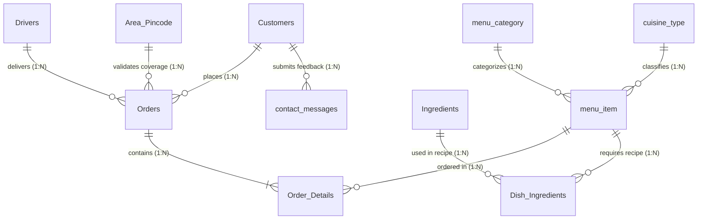

# 🗄️ Database Architecture & Complete 11-Table Schema Reference

## 1. Executive Summary & Connection Config
The **Cloud Kitchen Database System** is powered by Microsoft SQL Server (`MSSQLLocalDB`). The architecture consists of **11 core database tables** managing customer accounts, order transactions, line item details, menu dishes, food categories, cuisine types, raw ingredient inventories, recipe bill of materials (BOM), pincode coverage zones, delivery driver tracking, and customer contact feedback.

- **Connection String Key**: `constr`
- **Database Local File**: `MyKitchenn.mdf`
- **Data Source**: `(LocalDB)\MSSQLLocalDB;AttachDbFilename=|DataDirectory|\MyKitchenn.mdf;Integrated Security=True`

---

## 2. Global Entity Relationship Diagram (ERD)

---

## 3. Comprehensive Breakdown of All 11 Tables

---

### 3.1 Table 1: `Customers`
#### 📌 Functional Explanation
The `Customers` table stores registered user profiles for the Cloud Kitchen storefront. It records user credentials, contact details, and secure SHA256 hashed passwords. Each customer is assigned a unique `c_id` which links to their order history in `Orders` and feedback messages in `contact_messages`.

#### 📊 Table Schema Structure
| Column Name | Data Type | Nullable | Key / Constraint | Default Value | Field Description |
| :--- | :--- | :--- | :--- | :--- | :--- |
| `c_id` | `INT` | NO | **Primary Key**, IDENTITY(1,1) | Auto-increment | Unique customer account ID |
| `c_name` | `NVARCHAR(50)` | NO | None | None | Customer full name |
| `email` | `NVARCHAR(40)` | NO | None | None | Primary login email address |
| `phone` | `NVARCHAR(13)` | NO | None | None | Mobile contact number (`+91...`) |
| `password` | `NVARCHAR(256)`| NO | None | None | Secure SHA256 hashed password string |

#### 🔗 Key Relationships & Rules
- **Primary Key**: `c_id`
- **Referenced By**: `Orders(c_id)`, `contact_messages(c_id)`

---

### 3.2 Table 2: `Orders`
#### 📌 Functional Explanation
The `Orders` table is the core transaction ledger for all customer orders placed in the system. It tracks order placement timestamps, net total bill amounts (inclusive of all taxes), current kitchen/delivery statuses (`Pending`, `Preparing`, `Out for Delivery`, `Completed`, `Cancelled`), delivery addresses, 6-digit postal pincodes, payment modes, assigned delivery driver IDs, and a confidential 4-digit Delivery OTP (`delivery_otp`) for secure handoff verification.

#### 📊 Table Schema Structure
| Column Name | Data Type | Nullable | Key / Constraint | Default Value | Field Description |
| :--- | :--- | :--- | :--- | :--- | :--- |
| `order_id` | `INT` | NO | **Primary Key**, IDENTITY(1,1) | Auto-increment | Unique order receipt number |
| `c_id` | `INT` | NO | Foreign Key -> `Customers(c_id)` | None | Customer ID who placed the order |
| `total_amount` | `DECIMAL(10,2)`| NO | None | None | Net bill total (Incl. of all taxes & GST) |
| `order_status` | `NVARCHAR(50)` | YES | Enum (`Pending`, `Preparing`, `Out for Delivery`, `Completed`, `Cancelled`) | `'Pending'` | Real-time order preparation/delivery status |
| `order_date` | `DATETIME` | YES | None | `getdate()` | Timestamp when order was submitted |
| `address` | `NVARCHAR(255)`| NO | None | None | Street delivery address |
| `pincode` | `NVARCHAR(10)` | NO | Foreign Key -> `Area_Pincode(Pincode)` | None | 6-Digit delivery postal pincode |
| `payment_type` | `NVARCHAR(50)` | NO | None | None | Payment mode (`Cash on Delivery`, `Razorpay`, `UPI Payment`) |
| `transaction_number` | `NVARCHAR(50)` | YES | None | NULL | Gateway transaction reference ID |
| `driver_id` | `INT` | YES | Foreign Key -> `Drivers(driver_id)` | NULL | Assigned delivery driver ID |
| `delivery_otp` | `VARCHAR(6)` | YES | None | NULL | Confidential 4-digit OTP for delivery verification |
| `delivered_time` | `DATETIME` | YES | None | NULL | Timestamp when driver verified OTP and marked completed |
| `delivery_notes` | `NVARCHAR(255)`| YES | None | NULL | Customer notes/instructions for delivery partner |

#### 🔗 Key Relationships & Rules
- **Primary Key**: `order_id`
- **Foreign Keys**: `c_id` -> `Customers(c_id)`, `driver_id` -> `Drivers(driver_id)`, `pincode` -> `Area_Pincode(Pincode)`
- **Referenced By**: `Order_Details(order_id)`

---

### 3.3 Table 3: `Order_Details`
#### 📌 Functional Explanation
The `Order_Details` table holds the individual line items for each order transaction. It specifies which food dishes (`m_id`) were ordered, the quantity requested, the unit price at checkout, and the line item total price (`quantity * price`). This table links orders to `menu_item` records for sales analytics and kitchen preparation queues.

#### 📊 Table Schema Structure
| Column Name | Data Type | Nullable | Key / Constraint | Default Value | Field Description |
| :--- | :--- | :--- | :--- | :--- | :--- |
| `order_detail_id` | `INT` | NO | **Primary Key**, IDENTITY(1,1) | Auto-increment | Unique detail line item ID |
| `order_id` | `INT` | NO | Foreign Key -> `Orders(order_id)` | None | Parent order transaction ID |
| `m_id` | `INT` | NO | Foreign Key -> `menu_item(m_id)` | None | Ordered dish reference ID |
| `quantity` | `INT` | NO | CHECK (`quantity > 0`) | None | Quantity of dish ordered |
| `price` | `DECIMAL(10,2)`| NO | None | None | Unit price per dish at purchase time |
| `total_price` | `DECIMAL(10,2)`| NO | None | None | Line item subtotal (`quantity * price`) |

#### 🔗 Key Relationships & Rules
- **Primary Key**: `order_detail_id`
- **Foreign Keys**: `order_id` -> `Orders(order_id)` (ON DELETE CASCADE), `m_id` -> `menu_item(m_id)` (ON DELETE CASCADE)

---

### 3.4 Table 4: `menu_item`
#### 📌 Functional Explanation
The `menu_item` table represents all food dishes available on the Cloud Kitchen menu. It maintains dish names, category linkages (`m_category_id`), cuisine classifications (`m_cuisine_id`), descriptions, base list prices (`m_price`), discount percentages (`m_discount`), net final prices (`m_final_price`), relative image URLs, availability flags (`m_availability`), featured carousel flags (`m_featured`), and inventory tracking settings.

#### 📊 Table Schema Structure
| Column Name | Data Type | Nullable | Key / Constraint | Default Value | Field Description |
| :--- | :--- | :--- | :--- | :--- | :--- |
| `m_id` | `INT` | NO | **Primary Key**, IDENTITY(1,1) | Auto-increment | Unique food dish ID |
| `m_name` | `NVARCHAR(100)`| NO | None | None | Dish title (e.g. *Paneer Butter Masala*) |
| `m_category_id` | `INT` | NO | Foreign Key -> `menu_category(category_id)` | None | Category ID link |
| `m_cuisine_id` | `INT` | NO | Foreign Key -> `cuisine_type(cuisine_id)` | None | Regional cuisine ID link |
| `m_description` | `NVARCHAR(255)`| YES | None | NULL | Dish description & ingredients summary |
| `m_price` | `NUMERIC(6,2)` | NO | None | None | Base menu price before discount |
| `m_discount` | `NUMERIC(5,2)` | YES | None | `0.00` | Percentage discount applied |
| `m_final_price` | `NUMERIC(6,2)` | YES | None | Computed | Selling price after discount |
| `m_image_url` | `NVARCHAR(255)`| YES | None | NULL | Image asset file path |
| `m_availability` | `BIT` | NO | Flag (`1` = Available, `0` = Sold Out) | `1` | Menu visibility status |
| `m_featured` | `BIT` | NO | Flag (`1` = Featured, `0` = Standard) | `0` | Home page featured carousel flag |
| `m_status` | `BIT` | NO | Flag (`1` = Active, `0` = Disabled) | `1` | Active item status |
| `m_track_inventory` | `BIT` | YES | Flag (`1` = Track, `0` = Ignore) | `1` | Enable raw stock deduction on order |
| `m_unit_stock` | `INT` | YES | None | NULL | Direct unit count if non-recipe dish |

#### 🔗 Key Relationships & Rules
- **Primary Key**: `m_id`
- **Foreign Keys**: `m_category_id` -> `menu_category(category_id)` (ON DELETE CASCADE), `m_cuisine_id` -> `cuisine_type(cuisine_id)` (ON DELETE CASCADE)
- **Referenced By**: `Order_Details(m_id)`, `Dish_Ingredients(m_id)`

---

### 3.5 Table 5: `menu_category`
#### 📌 Functional Explanation
The `menu_category` table defines high-level food groupings such as *Vegetarian*, *Non Vegetarian*, *Snacks*, *Sweets*, and *Starters*. It allows kitchen admins to organize the menu storefront and filter reports by category.

#### 📊 Table Schema Structure
| Column Name | Data Type | Nullable | Key / Constraint | Default Value | Field Description |
| :--- | :--- | :--- | :--- | :--- | :--- |
| `category_id` | `INT` | NO | **Primary Key**, IDENTITY(1,1) | Auto-increment | Unique category ID |
| `category_name` | `VARCHAR(50)` | NO | None | None | Category title (*Vegetarian*, *Non Vegetarian*, *Snacks*, *Sweets*, *Starters*) |
| `category_status` | `BIT` | NO | Flag (`1` = Active, `0` = Disabled) | `1` | Category active status |

#### 🔗 Key Relationships & Rules
- **Primary Key**: `category_id`
- **Referenced By**: `menu_item(m_category_id)`

---

### 3.6 Table 6: `cuisine_type`
#### 📌 Functional Explanation
The `cuisine_type` table organizes food dishes into regional culinary styles like *North Indian*, *South Indian*, *Mughlai*, *Street Food*, and *Desserts*. This metadata drives customer filtering on `Menu.aspx` and revenue analytics in `Reports.aspx`.

#### 📊 Table Schema Structure
| Column Name | Data Type | Nullable | Key / Constraint | Default Value | Field Description |
| :--- | :--- | :--- | :--- | :--- | :--- |
| `cuisine_id` | `INT` | NO | **Primary Key**, IDENTITY(1,1) | Auto-increment | Unique cuisine ID |
| `cuisine_name` | `NVARCHAR(50)` | NO | None | None | Cuisine title (*North Indian*, *South Indian*, *Mughlai*, *Street Food*, *Desserts*) |
| `cuisine_status` | `BIT` | NO | Flag (`1` = Active, `0` = Disabled) | `1` | Cuisine active status |

#### 🔗 Key Relationships & Rules
- **Primary Key**: `cuisine_id`
- **Referenced By**: `menu_item(m_cuisine_id)`

---

### 3.7 Table 7: `Ingredients`
#### 📌 Functional Explanation
The `Ingredients` table tracks raw kitchen inventory stock levels (e.g. *Paneer*, *Butter*, *Basmati Rice*, *Chicken*). It maintains the physical stock quantity, unit of measurement (`kg`, `L`, `pcs`), cost per unit, low stock alert threshold, and last update timestamp. Stock is automatically deducted when customer orders are placed.

#### 📊 Table Schema Structure
| Column Name | Data Type | Nullable | Key / Constraint | Default Value | Field Description |
| :--- | :--- | :--- | :--- | :--- | :--- |
| `ingredient_id` | `INT` | NO | **Primary Key**, IDENTITY(1,1) | Auto-increment | Unique raw ingredient ID |
| `ingredient_name` | `VARCHAR(100)` | NO | None | None | Raw ingredient title (e.g. *Paneer*, *Butter*, *Basmati Rice*) |
| `stock_quantity` | `DECIMAL(10,2)`| NO | None | `0.00` | Current physical stock in kitchen |
| `unit` | `VARCHAR(20)` | NO | Unit (`kg`, `L`, `pcs`, `grams`) | None | Unit of measurement |
| `cost_per_unit` | `DECIMAL(10,2)`| YES | None | `0.00` | Cost price per unit quantity (₹) |
| `low_stock_threshold` | `DECIMAL(10,2)`| YES | None | `2.00` | Threshold value to trigger low-stock alert |
| `last_updated` | `DATETIME` | YES | None | `getdate()` | Timestamp of last stock restock/deduction |

#### 🔗 Key Relationships & Rules
- **Primary Key**: `ingredient_id`
- **Referenced By**: `Dish_Ingredients(ingredient_id)`

---

### 3.8 Table 8: `Dish_Ingredients`
#### 📌 Functional Explanation
The `Dish_Ingredients` table serves as the Recipe Bill of Materials (BOM) mapping table. It links a menu dish (`m_id`) to its required raw ingredients (`ingredient_id`) and specifies the exact quantity (`qty_required`) needed to cook 1 portion of that dish.

#### 📊 Table Schema Structure
| Column Name | Data Type | Nullable | Key / Constraint | Default Value | Field Description |
| :--- | :--- | :--- | :--- | :--- | :--- |
| `recipe_id` | `INT` | NO | **Primary Key**, IDENTITY(1,1) | Auto-increment | Unique recipe mapping ID |
| `m_id` | `INT` | NO | Foreign Key -> `menu_item(m_id)` | None | Target food dish ID |
| `ingredient_id` | `INT` | NO | Foreign Key -> `Ingredients(ingredient_id)` | None | Raw ingredient ID |
| `qty_required` | `DECIMAL(10,2)`| NO | None | None | Quantity of ingredient consumed per 1 portion |

#### 🔗 Key Relationships & Rules
- **Primary Key**: `recipe_id`
- **Foreign Keys**: `m_id` -> `menu_item(m_id)` (ON DELETE CASCADE), `ingredient_id` -> `Ingredients(ingredient_id)` (ON DELETE CASCADE)

---

### 3.9 Table 9: `Area_Pincode`
#### 📌 Functional Explanation
The `Area_Pincode` table defines active delivery coverage zones and 6-digit postal pincodes (e.g. `388120`, `388121`, `388315`). When a customer places an order, `Cart.aspx.vb` verifies that their delivery pincode exists in this table before allowing checkout.

#### 📊 Table Schema Structure
| Column Name | Data Type | Nullable | Key / Constraint | Default Value | Field Description |
| :--- | :--- | :--- | :--- | :--- | :--- |
| `Area_Id` | `INT` | NO | **Primary Key**, IDENTITY(1,1) | Auto-increment | Unique area ID |
| `Area_Name` | `NVARCHAR(255)`| NO | None | None | Location/Zone name (*Vallabh Vidhyanagar*, *Anand*, *Bakrol*) |
| `Pincode` | `NVARCHAR(10)` | NO | **Unique Key** | None | 6-Digit postal pincode |

#### 🔗 Key Relationships & Rules
- **Primary Key**: `Area_Id`
- **Unique Constraint**: `Pincode`
- **Referenced By**: `Orders(pincode)`

---

### 3.10 Table 10: `Drivers`
#### 📌 Functional Explanation
The `Drivers` table manages delivery partner accounts, login credentials, contact numbers (`phone`), vehicle registration numbers, and live duty status (`Available`, `On Delivery`, `Offline`, `Inactive`). Drivers log into `DriverPortal.aspx` to claim kitchen orders and enter customer delivery OTPs.

#### 📊 Table Schema Structure
| Column Name | Data Type | Nullable | Key / Constraint | Default Value | Field Description |
| :--- | :--- | :--- | :--- | :--- | :--- |
| `driver_id` | `INT` | NO | **Primary Key**, IDENTITY(1,1) | Auto-increment | Unique delivery driver ID |
| `driver_name` | `NVARCHAR(100)`| NO | None | None | Driver full name |
| `phone` | `NVARCHAR(15)` | NO | **Unique Key** | None | Mobile phone number used for login |
| `password` | `NVARCHAR(50)` | NO | None | None | Driver portal password |
| `vehicle_no` | `NVARCHAR(20)` | NO | None | None | Vehicle registration number (e.g. `GJ-23-AB-1234`) |
| `status` | `NVARCHAR(20)` | NO | Enum (`Available`, `On Delivery`, `Offline`, `Inactive`) | `'Available'` | Live delivery duty status |
| `created_date` | `DATETIME` | NO | None | `getdate()` | Registration timestamp |

#### 🔗 Key Relationships & Rules
- **Primary Key**: `driver_id`
- **Unique Constraint**: `phone`
- **Referenced By**: `Orders(driver_id)`

---

### 3.11 Table 11: `contact_messages`
#### 📌 Functional Explanation
The `contact_messages` table stores customer inquiries, feedback messages, ratings, and reviews submitted via `Home.aspx` or `Contact_Msg.aspx`. It records sender names, emails, message text, submission timestamps, and an admin read/unread status flag (`status`).

#### 📊 Table Schema Structure
| Column Name | Data Type | Nullable | Key / Constraint | Default Value | Field Description |
| :--- | :--- | :--- | :--- | :--- | :--- |
| `message_id` | `INT` | NO | **Primary Key**, IDENTITY(1,1) | Auto-increment | Unique message ID |
| `c_id` | `INT` | YES | Foreign Key -> `Customers(c_id)` | NULL | Customer ID if logged in |
| `name` | `NVARCHAR(50)` | NO | None | None | Sender full name |
| `email` | `NVARCHAR(50)` | NO | None | None | Sender contact email address |
| `message` | `NVARCHAR(500)`| NO | None | None | Feedback or inquiry text |
| `submitted_at` | `DATETIME` | YES | None | `getdate()` | Timestamp when message was submitted |
| `status` | `BIT` | YES | Flag (`0` = Unread, `1` = Read) | `0` | Admin review status flag |

#### 🔗 Key Relationships & Rules
- **Primary Key**: `message_id`
- **Foreign Key**: `c_id` -> `Customers(c_id)`

---

## 4. Financial & Business Operational Rules

1. **Tax Inclusive Pricing**:
   - `Orders.total_amount = SUM(Order_Details.quantity * Order_Details.price)`
   - All food prices listed in `menu_item.m_price` and `menu_item.m_final_price` are **inclusive of all taxes & GST**. No separate tax surcharge is added at checkout.

2. **Automated Stock Deduction**:
   - Placing or preparing an order queries `Dish_Ingredients` for each dish (`m_id`) and subtracts `qty_required * quantity` from `Ingredients.stock_quantity`.

3. **Delivery OTP Verification**:
   - `Orders.delivery_otp` is a 4-digit code generated upon order creation. Delivery partners enter this code in `DriverPortal.aspx` to transition `order_status` to `Completed`.
