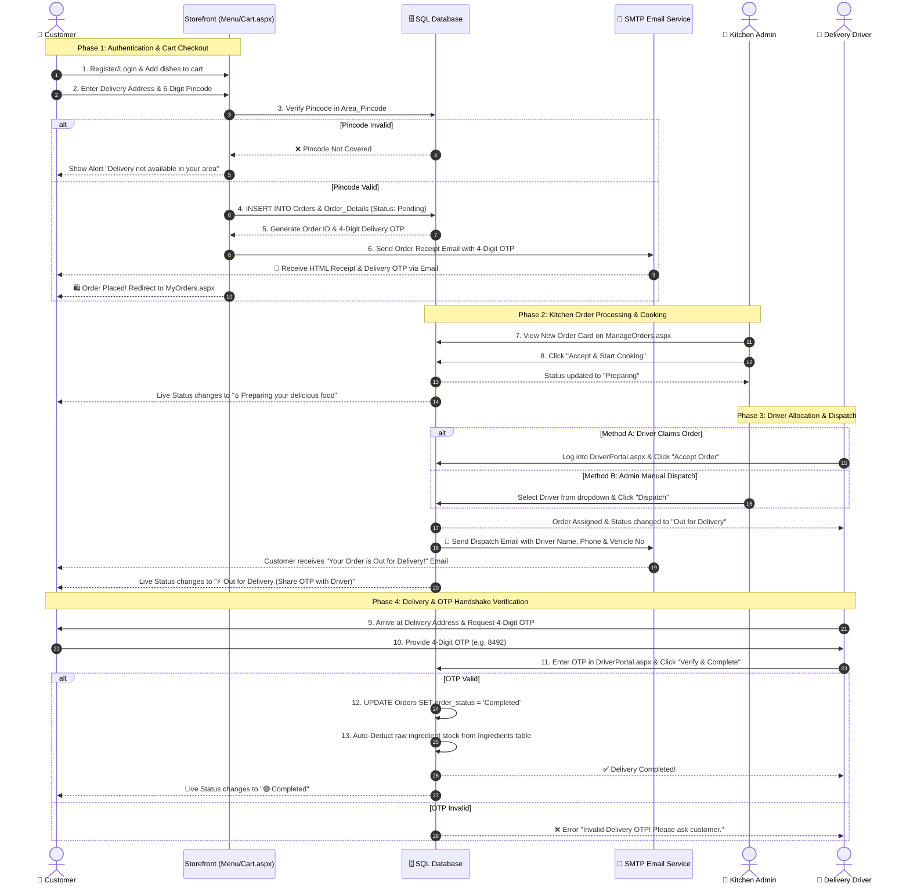
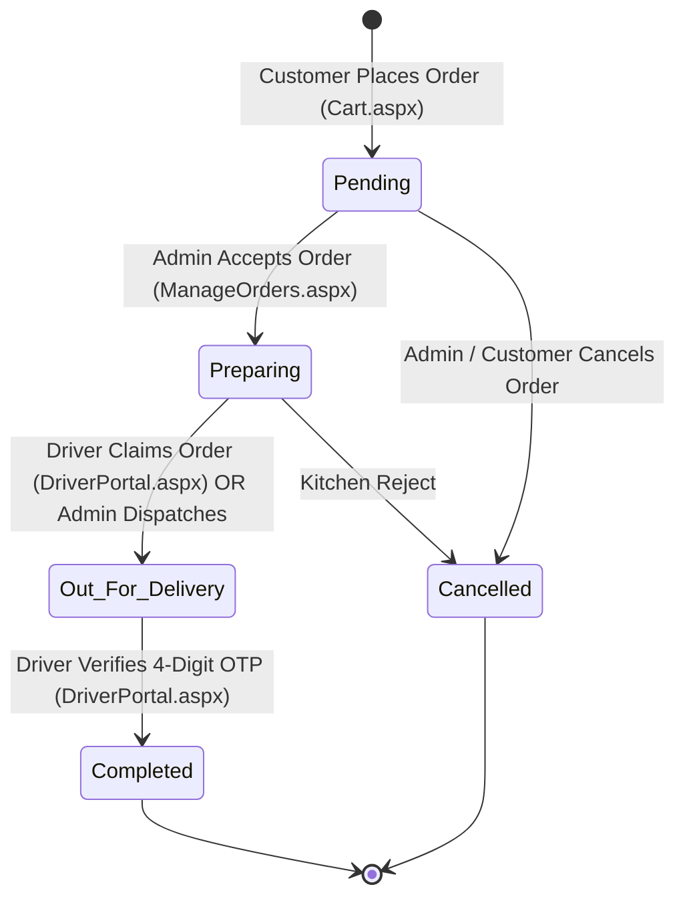

# ⚡ Master End-to-End Cloud Kitchen System Workflow Documentation

## 1. Executive System Architecture Overview
The **Cloud Kitchen Management System** is a full-stack, enterprise-grade ASP.NET WebForms application built with Visual Basic .NET (`VB.NET`) and Microsoft SQL Server (`MSSQLLocalDB`).

The system seamlessly integrates **3 distinct actor entities** with automated background engines:
1. **🛒 Customer Entity**: Browses dishes, checks delivery pincode coverage, places orders (COD/Online), tracks live preparation progress, and receives automated HTML invoice emails with a secure 4-digit Delivery OTP.
2. **👑 Admin Kitchen Entity**: Manages live revenue dashboards, dish recipes (`Dish_Ingredients`), raw stock levels (`Ingredients`), menu categories/cuisines, service pincodes (`Area_Pincode`), kitchen cooking queues, and dispatches delivery drivers.
3. **🛵 Delivery Driver Entity**: Views available kitchen order pools, claims unassigned orders, navigates to customer addresses, verifies delivery using the customer's confidential 4-digit OTP, and completes order handoffs.
4. **⚙️ Automated Engines**: Automated Inventory Deduction Engine, OTP Security Generator, Pincode Coverage Validator, and Report Export Engine.

---

## 2. Master End-to-End System Sequence Diagram

---

## 3. Comprehensive Step-by-Step Subsystem Lifecycles

---

### Phase 1: Customer Account & Shopping Journey
1. **User Registration & Security (`Register.aspx`)**:
   - Customer inputs Full Name, Email, Mobile Number (`+91`), and Password.
   - Client-side validators inspect required fields, email format, and password complexity.
   - `IsEmailExists()` and `IsPhoneExists()` check duplicate accounts in `Customers`.
   - Passwords are encrypted using SHA256 hashing before storing in `Customers.password`.

2. **Menu Exploration & Filtering (`Menu.aspx`)**:
   - Queries `menu_item` joined with `menu_category` and `cuisine_type`.
   - Customers filter dishes by category (*Vegetarian*, *Non Vegetarian*, *Snacks*, *Sweets*, *Starters*) or cuisine (*North Indian*, *South Indian*, *Mughlai*, *Street Food*, *Desserts*).
   - Menu cards display final selling prices `m_final_price` (inclusive of all taxes & GST) and dish images.

3. **Cart Management & Pincode Protection (`Cart.aspx`)**:
   - Items added to cart are managed via session state.
   - Customers select or enter their 6-digit delivery postal pincode.
   - `Cart.aspx.vb` performs a lookup against `Area_Pincode`. If the pincode is missing, checkout is blocked with a clear coverage warning.

---

### Phase 2: Order Placement, OTP & Email Dispatch
1. **Database Transaction (`Orders` & `Order_Details`)**:
   - Calculates total bill amount `Orders.total_amount` (Sum of `quantity * price`).
   - Auto-generates a random 4-digit security OTP (`Orders.delivery_otp`).
   - Inserts master row into `Orders` with initial status `'Pending'`.
   - Inserts line items into `Order_Details` (`order_id`, `m_id`, `quantity`, `price`, `total_price`).

2. **Automated Invoice Email (`SmtpClient`)**:
   - Triggers background SMTP email service to send a thermal receipt HTML invoice to `Customers.email`.
   - Receipt highlights itemized breakdown, total bill amount `(Incl. of all taxes & GST)`, delivery address, and the confidential 4-digit Delivery OTP.

---

### Phase 3: Kitchen Operations & Inventory Management
1. **Kitchen Live Queue (`ManageOrders.aspx`)**:
   - Kitchen admins view incoming orders sorted by timestamp (`order_date DESC`).
   - Admin reviews ordered items, customer phone number, delivery address, and payment method.
   - Clicking **"Accept & Start Cooking"** updates `Orders.order_status` to `'Preparing'`.

2. **Raw Inventory Auto-Deduction (`ManageInventory.aspx`)**:
   - The kitchen stock engine checks `Dish_Ingredients` (Recipe Bill of Materials) for each ordered dish (`m_id`).
   - Deducts `qty_required * quantity` from `Ingredients.stock_quantity`.
   - If `stock_quantity <= low_stock_threshold`, a low-stock alert badge is flagged on `Dashboard.aspx` and `ManageInventory.aspx`.

---

### Phase 4: Delivery Partner Claim & Secure Handshake
1. **Order Claiming (`DriverPortal.aspx`)**:
   - Delivery drivers log into `DriverPortal.aspx` using their registered phone number and password.
   - The pool displays active kitchen orders in *Preparing* status.
   - Driver clicks **"Accept Order"**, which assigns `Orders.driver_id = @DriverId`, updates driver status to `'On Delivery'`, and updates order status to `'Out for Delivery'`.

2. **Customer Dispatch Email**:
   - Automatically sends a secondary dispatch email to the customer notifying them that their order is on the way, including the driver's full name, phone number (`tel:` link), and vehicle registration number.

3. **4-Digit OTP Verification**:
   - Upon arriving at the delivery location, the driver requests the 4-digit OTP from the customer.
   - Driver inputs the code into `txtOTP` in `DriverPortal.aspx`.
   - The portal compares the input against `Orders.delivery_otp`. Upon exact match, `Orders.order_status` transitions to `'Completed'`, `Orders.delivered_time` is recorded, and the driver's duty status returns to `'Available'`.

---

### Phase 5: Business Intelligence & Multi-Dimension Reporting
1. **Real-Time Analytics (`Dashboard.aspx`)**:
   - Displays live total revenue, order count, active customer metrics, top-selling dishes, low-stock warnings, and recent order stream without inner scrollbars.

2. **Comprehensive Report Generation (`Reports.aspx`)**:
   - Admin generates custom date-filtered reports for **19 different dimensions**, including:
     - 📃 Orders Report
     - 👥 Customers Report
     - 🍽️ Menu Items Report
     - 📩 Contact Messages Report
     - 📊 Daily Sales Report
     - 🔥 Top Selling Menu Items
     - 📜 Customer Order Summary
     - 📌 Active vs Inactive Customers
     - 🍛 Revenue by Cuisine Type
     - 🛒 Pending vs Completed Orders
     - 🏆 Most Loyal Customers
     - 💰 Highest Total Amount Orders
     - 💬 Customer Feedback Report
     - 🥦 Raw Ingredient Stock Status
     - 📈 Ingredient Consumption History
     - 💰 Recipe Food Costing & Margin
     - 🛵 Driver-Wise Delivery Quantity & Performance
     - 📦 Category-Wise Sales & Volume
     - 📍 Area & Pincode Delivery Distribution
   - Supports 1-click **Excel Export** and **Thermal Printing**.

---

## 4. Order Status Transition Lifecycle

---

## 5. Security & Financial Business Policies

1. **Inclusive Tax Policy**:
   - Menu item prices listed in `menu_item.m_price` and `menu_item.m_final_price` are **inclusive of all taxes and GST**.
   - No hidden 5% GST surcharge is added at checkout.

2. **Pincode Delivery Safeguard**:
   - Order checkout is strictly blocked if the target delivery pincode is not present in `Area_Pincode`.

3. **OTP Handoff Protection**:
   - Orders cannot be marked completed without matching the exact 4-digit numeric code generated at checkout.

4. **Credential Security**:
   - Customer passwords are encrypted with SHA256 before database insertion.
   - Persistent user sessions are managed securely via `CookieHelper.vb`.
