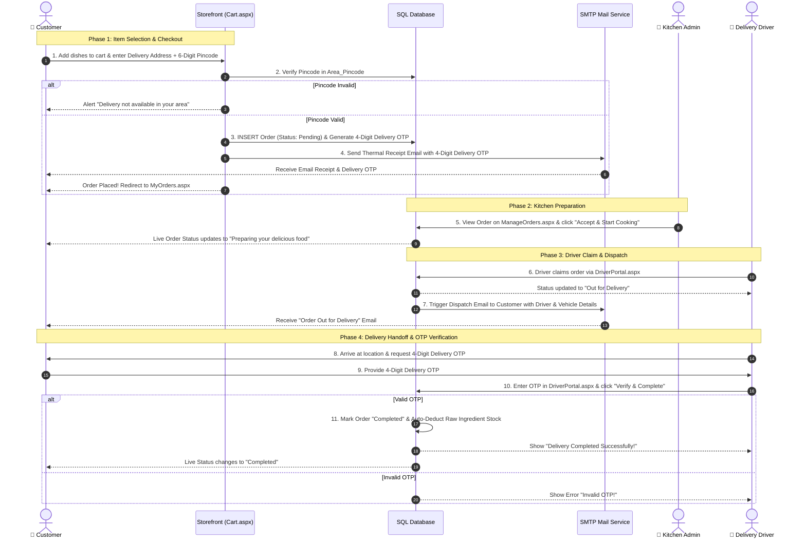
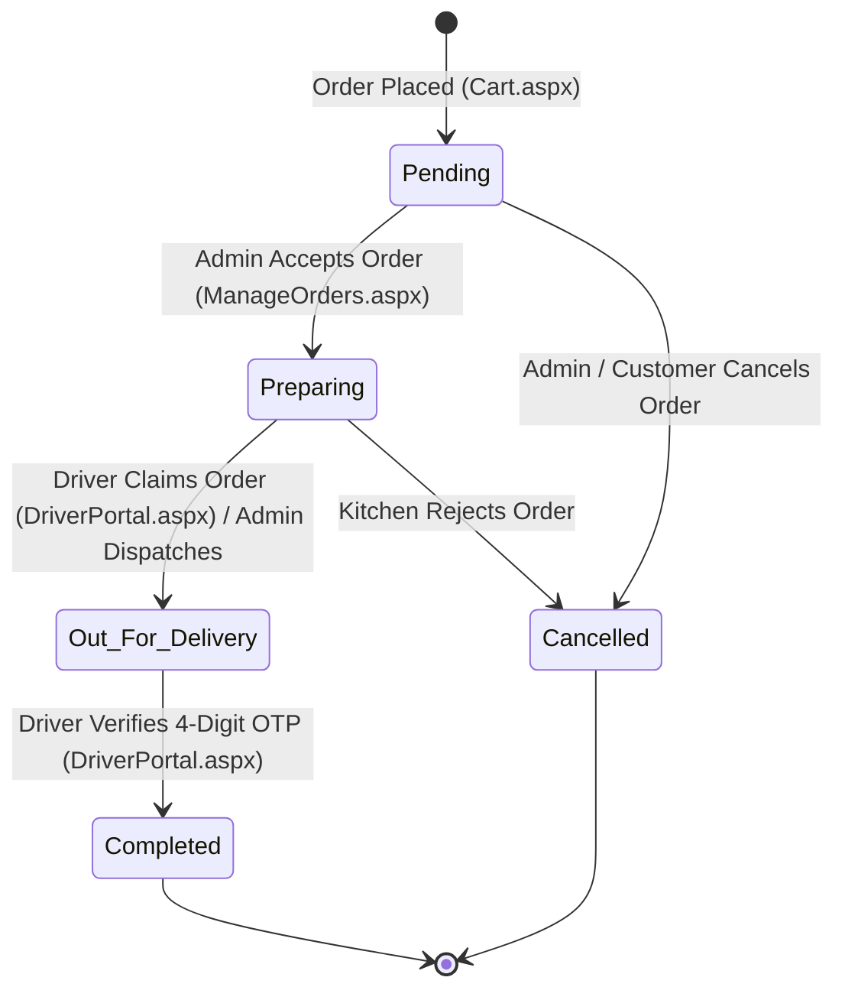
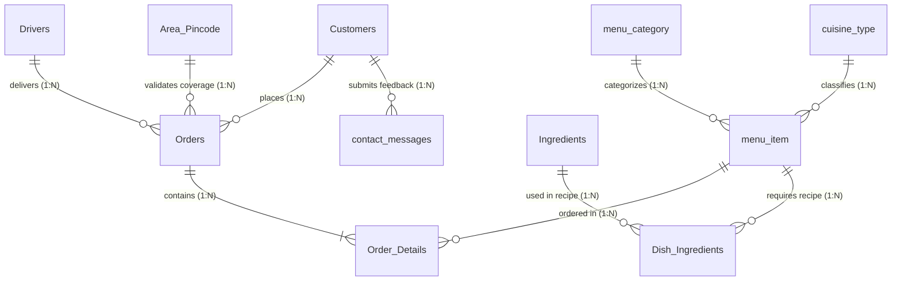

# 🍽️ Cloud Kitchen Management System

> An enterprise-grade, database-driven **Cloud Kitchen Management System** developed using **ASP.NET (VB.NET)** and **MSSQL Server**. Streamlines customer online food ordering, live kitchen preparation queues, automated recipe raw ingredient stock deduction, delivery area pincode coverage validation, delivery partner claims, and 4-digit Delivery OTP handoffs.

---

## 🚀 Overview

The **Cloud Kitchen Management System** is a full-stack web application designed to handle end-to-end food delivery and kitchen operations. It integrates **3 primary actor entities** alongside automated background engines:

1. **🛒 Customer Storefront**: Browse food dishes with category/cuisine filters, validate delivery pincodes, place orders via COD or Online payments, track real-time preparation progress, and receive thermal invoice emails with a confidential 4-digit Delivery OTP.
2. **👑 Admin Kitchen Portal**: Real-time revenue dashboard, dish recipe (BOM) & food menu management, raw ingredient stock tracking, kitchen order preparation queues, delivery area pincode management, driver dispatches, and 19 multi-dimensional analytical reports.
3. **🛵 Delivery Driver Portal**: View available kitchen orders, claim orders, navigate to customer addresses, verify delivery via a secure 4-digit OTP, and complete order handoffs.
4. **⚙️ Automated Engines**: Automated Inventory Auto-Deduction Engine, Delivery OTP Security Engine, Delivery Coverage Safeguard, and Excel/Thermal Report Exporters.

---

## 🛠️ Technologies Used

| Layer | Technologies / Tools |
| :--- | :--- |
| **Backend** | ASP.NET WebForms (Framework 4.0), VB.NET |
| **Database** | MSSQL Server |
| **Frontend** | HTML5, CSS3, JavaScript, Bootstrap 5, FontAwesome |
| **UI Components** | Chart.js (Analytics), SweetAlert (Modals & Alerts), Thermal Print Generators |
| **Email Service** | `System.Net.Mail` (SMTP Client HTML Invoice Receipts & Driver Dispatch Emails) |
| **Development IDE** | Visual Studio 2022  |

---

## 🔑 Key Subsystems & Features

### 🛒 Customer Storefront
- **Account & Security**: Registration, SHA256 hashed password authentication, persistent cookie session management (`CookieHelper.vb`), and account profile management.
- **Menu Exploration**: Search dishes, filter by Category (*Vegetarian*, *Non Vegetarian*, *Snacks*, *Sweets*, *Starters*) or Cuisine (*North Indian*, *South Indian*, *Mughlai*, *Street Food*, *Desserts*).
- **Delivery Area Safeguard**: Real-time pincode verification against `Area_Pincode` prior to order checkout.
- **Cart & Flexible Checkout**: Manage cart items, compute subtotal and total bill amount with **inclusive tax & GST policy** (no hidden tax surcharges). Supports Cash on Delivery (COD) and Online Payments (UPI / Gateway).
- **Automated HTML Thermal Receipts**: Instant email notification with thermal invoice summary and confidential 4-digit Delivery OTP.
- **Live Order Tracking**: Real-time status updates (`Pending` ➔ `Preparing` ➔ `Out for Delivery` ➔ `Completed`).

### 👑 Admin Kitchen Portal
- **Real-Time Revenue Dashboard**: Displays live revenue metrics, order counts, active customer stats, top-selling dishes, low-stock warnings, and recent order feeds (clean zero-scrollbar UI).
- **Food Menu & Recipe Management**: Add/Edit dishes (`AddFoodItems.aspx`), configure item prices, set availability flags, upload images, and assign Recipe Bill of Materials (BOM).
- **Raw Ingredient Inventory Control**: Monitor stock levels (`Ingredients` table), configure safety thresholds, receive low-stock alerts, and auto-deduct raw materials upon cooking/order placement.
- **Kitchen Cooking Queue & Orders**: View order cards, accept & start cooking, assign delivery drivers, and print thermal invoices (`ManageOrders.aspx`).
- **Service Area & Pincode Control**: Manage active delivery zones and 6-digit pincodes (`Area_Pincode`) with custom glassmorphism modal dialogs.
- **Delivery Partner Management**: Add/Edit drivers (`Drivers`), assign vehicle numbers, track driver status (`Available`, `On Delivery`, `Offline`).
- **19 Multi-Dimensional Business Reports**: Date-filtered analytics with 1-click **Excel Export** and **Thermal Printing**:
  - *Orders, Customers, Menu Items, Contact Messages, Daily Sales, Top Selling Dishes, Customer Loyalty, Cuisine Revenue, Stock Status, Recipe Costing & Margins, Driver Performance, Area Delivery Distribution, and more.*

### 🛵 Delivery Driver Portal
- **Driver Authentication**: Secure phone-number based driver portal login (`DriverPortal.aspx`).
- **Order Pool & Claiming**: Drivers view orders in *Preparing* state and claim them with 1-click ("Accept Order & Start Delivery").
- **Customer Contact & Navigation**: View customer delivery address, phone link (`tel:`), and order breakdown.
- **Automated Dispatch Email**: Triggers customer email notification with driver name, phone number, and vehicle registration.
- **Secure 4-Digit OTP Handshake**: Complete delivery by entering the customer's 4-digit Delivery OTP (`delivery_otp`) for instant validation.

---

## 🔄 End-to-End System Workflow



---

## 📊 Order Status Lifecycle



---

## 🗄️ Database Architecture (11 Core Tables)

The system operates on an 11-table relational SQL Server database (`MyKitchenn.mdf`):



| Table Name | Description | Key Columns |
| :--- | :--- | :--- |
| **`Customers`** | Customer accounts & credentials | `c_id` (PK), `c_name`, `email`, `phone`, `password` (SHA256) |
| **`Orders`** | Master order header transactions | `order_id` (PK), `c_id`, `total_amount`, `order_status`, `pincode`, `delivery_otp`, `driver_id` |
| **`Order_Details`** | Ordered line items breakdown | `order_detail_id` (PK), `order_id`, `m_id`, `quantity`, `price`, `total_price` |
| **`menu_item`** | Food dishes & pricing | `m_id` (PK), `m_name`, `m_category_id`, `m_cuisine_id`, `m_price`, `m_final_price`, `m_availability` |
| **`menu_category`** | Food categories | `category_id` (PK), `category_name` (*Vegetarian*, *Non Vegetarian*, *Snacks*, etc.) |
| **`cuisine_type`** | Regional cuisines | `cuisine_id` (PK), `cuisine_name` (*North Indian*, *South Indian*, *Mughlai*, etc.) |
| **`Ingredients`** | Raw inventory stock tracking | `ingredient_id` (PK), `ingredient_name`, `stock_quantity`, `unit`, `low_stock_threshold` |
| **`Dish_Ingredients`** | Recipe Bill of Materials (BOM) | `recipe_id` (PK), `m_id`, `ingredient_id`, `qty_required` |
| **`Area_Pincode`** | Active delivery coverage pincodes | `Area_Id` (PK), `Area_Name`, `Pincode` (Unique) |
| **`Drivers`** | Delivery partner details & status | `driver_id` (PK), `driver_name`, `phone`, `password`, `vehicle_no`, `status` |
| **`contact_messages`** | Customer feedback & inquiry messages | `message_id` (PK), `c_id`, `name`, `email`, `message`, `status` |

---

## 📸 Project Screenshots

### 🏠 Customer Storefront
| Home Page | User Login |
| :---: | :---: |
|  |  |

| User Registration | Food Menu & Filtering |
| :---: | :---: |
|  |  |

| Shopping Cart & Checkout | Order Confirmation |
| :---: | :---: |
|  |  |

| Order Receipt Email | Real-Time Order Tracking |
| :---: | :---: |
|  |  |

| Invoice Bill (Thermal Receipt) |
| :---: |
|  |

---

### 👑 Admin Control Panel
| Real-Time Dashboard | Food Menu Management |
| :---: | :---: |
|  |  |

| Cuisine & Category Management | Kitchen Order Queue & Dispatch |
| :---: | :---: |
|  |  |

| Service Area & Pincode Management | Customer Contact Messages |
| :---: | :---: |
|  |  |

| 19 Multi-Dimensional Business Reports |
| :---: |
|  |

---

## ▶️ How To Run & Setup

### Prerequisites
- Visual Studio 2022 / 2019 (with ASP.NET & Web Development workload)
- Microsoft SQL Server (`MSSQLLocalDB` or SQL Server Express)
- IIS Express (Built into Visual Studio)

### Step 1: Clone the Repository
```bash
git clone https://github.com/vinitsonii/Cloud_Kitchen.git
```

### Step 2: Open Project in Visual Studio
1. Open Visual Studio.
2. Select **Open a project or solution**.
3. Navigate to the project directory and open `Cloud Kitchen.sln`.

### Step 3: Configure Database
The database file `MyKitchenn.mdf` is located inside the `App_Data` folder.
- If using MSSQL LocalDB, the connection string in `Web.config` attaches `MyKitchenn.mdf` automatically:
  ```xml
  <connectionStrings>
      <add name="constr" connectionString="Data Source=(LocalDB)\MSSQLLocalDB;AttachDbFilename=|DataDirectory|\MyKitchenn.mdf;Integrated Security=True" providerName="System.Data.SqlClient"/>
  </connectionStrings>
  ```
- Alternatively, you can execute `ckmscriptnew.sql` in SQL Server Management Studio (SSMS) to restore the full schema and seed data.

### Step 4: Configure Mail Credentials in `Web.config`
Open `Web.config` and set your SMTP mail credentials for order receipt emails:
```xml
<appSettings>
    <add key="SMTPServer" value="smtp.gmail.com"/>
    <add key="SMTPPort" value="587"/>
    <add key="EmailUsername" value="YOUR_EMAIL@gmail.com"/>
    <add key="EmailPassword" value="YOUR_APP_PASSWORD"/>
</appSettings>
```

### Step 5: Default Login Credentials
- **Admin Portal**: `admincloudkitchen2026@gmail.com` / `password`
- **Delivery Driver Portal**: Login via registered driver phone number & password from `Drivers` table.

### Step 6: Launch the Application
Press `F5` or click **IIS Express** in Visual Studio to launch the project in your browser.

---

## 👨‍💻 Developer

### **Vinit Soni**
*Software Developer passionate about building robust web, mobile, and database-driven applications.*

- 🌐 **GitHub**: [github.com/vinitsonii](https://github.com/vinitsonii)
- 💼 **LinkedIn**: [linkedin.com/in/vinitsonii](https://linkedin.com/in/vinitsonii)

---

> *Built with ❤️ for Cloud Kitchen Operations & Seamless Food Delivery.*
